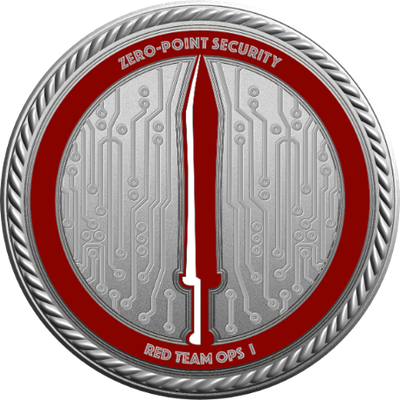
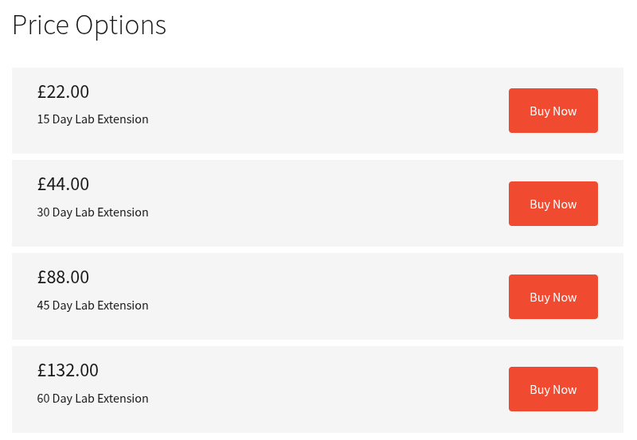
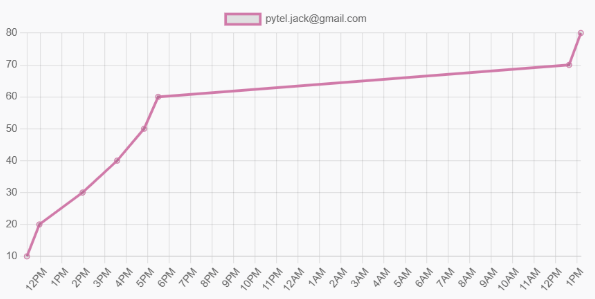

+++
title = 'Zero Point Security - Red Team Ops (CRTO) - Course Review'
date = 2025-04-11T10:46:43-04:00
draft = false
+++

# Review of Zero Point Security's Red Team Ops Course

## Overview
Zero Point Security's Red Team Ops course is an excellent course for those looking to up their skills to that of a red teamer. It serves as an entry point for those looking to get familiar with the industry's (most?) popular C2 framework, Cobalt Strike (CS).

The course covers a large amount of current-day pertinent content that will prepare you for effectively working within an Active Directory environment from both a beacon and an off-host perspective. From standing up your own CS team server, to performing Kerberos magic, and even modifying payloads to make them Defender-proof, the course has it all. At the very least, the course offers a great (fairly priced might I add) Active Directory playground for you to get familiar with Cobalt Strike and some AD-related attacks. Getting a license of CS for your own home lab may be slightly out of reach, as such, this course solves that issue for a fraction of the cost given it's reasonably priced lab times:

I personally always struggled with understanding and appropriately conceptualizing Kerberos authentication in my head. Getting hands on with the various Kerberos exchanges and seeing how they interconnect with the testing workflow, helped me to finally solidify that knowledge.

## Course Breakdown
You can find the full course description [here](https://training.zeropointsecurity.co.uk/courses/red-team-ops). The course is structured in a way that teaches you attacks, tools, and concepts as you progressively move through the full attack chain. For instance, the first few chapters (post introduction) help you set up your team server, listeners, payloads, delivery methods, and more. This way, once you start exploiting within the lab environment, you have all the tools you need to gain, or maintain, access. Then you will move into conducting external recon, through which you progress into initial access. Once within the environment, the course really takes off teaching you further recon methods using non-Bloodhound utilities, host persistence methods, and host pillaging for credentials. From there on, it gets more in-depth with each subsequent attack, or escalation method, ultimately leading you to complete ownage of the whole environment.

Ultimately, as the course recommends (and pretty much everybody else that has taken this course), you should re-run the entire (or portions) of the course with Defender enabled throughout the environment. This will serve as practice for the exam where each machine does have it on. But, once you build your C2 profile and modified binaries, you can copy these changes to your notes so that you do not have to do it all over again during the exam. You'd just simply update the pertinent files with your modified code and generate your payloads. This will significantly speed up your setup during the exam!

## Exam Overview
What I really enjoyed about the exam for this course is that everything covered within the course is what you are tested on within the exam. You could technically pass the whole exam with just having your course materials open. There's no real gotchas or rabbit holes (if you are familiar with offsec, you know what I mean), just straight testing your understanding of the material you just practiced. The lab is very close to what the course lab is, but the machines have different ways of gaining access to them. 

You get 40 hours of lab time usage to complete the exam, you can start and stop the exam lab as you please, but you will naturally lose your beacons while doing so. As such, I recommend leaving good persistence on all the boxes you compromise. I ended up leaving the lab running overnight as I had sufficient time to finish it.

The course requires you to get 6 flags to pass, but there's a total of 8. I highly recommend going for all of the flags to get the most out of the exam.

Personally I got all the flags I needed to pass within ~6 hours of starting the exam. At which point I called it for the day and revisited the exam the next day to get the last two flags.

### Exam Tips
There are certainly several topics that are used more than others during the exam. With that said, I would **HIGHLY** recommend that you practice using Rubeus and using the tickets you obtain through it, as you will be doing it a lot.

Another big thing I would urge you to practice is downloading and executing payloads on machines with Defender and AMSI on, through various means. Being able to quickly, and effectively, deploy your beacons will be a great quality of life improvement.

The last tip I'll share with you is being careful and understanding your recon results. After compromising each machine, you will want to make sure you are running your recon to uncover further paths to either escalation or compromise of other machines within the network. Read it carefully, know what you should be on the lookout for (based on what the course taught you), and obviously write it all down.

## Closing Thoughts
I very much enjoyed this course, which I can't say the same for many of the other courses I've taken in my career. I think Zero Point is doing a great job of presenting pertinent content and granting you the ability to practice the taught subjects in a controlled lab environment. Due to this, I will highly consider taking the Red Team Ops II course which dives a bit deeper into red teaming and OPSEC safe practices. If you are interested in that course as well, look out for my review in the future!
