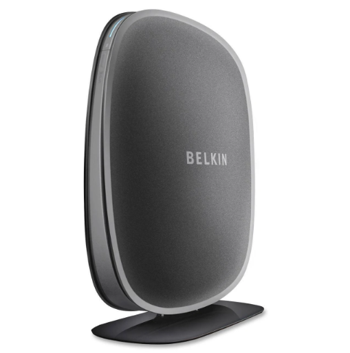
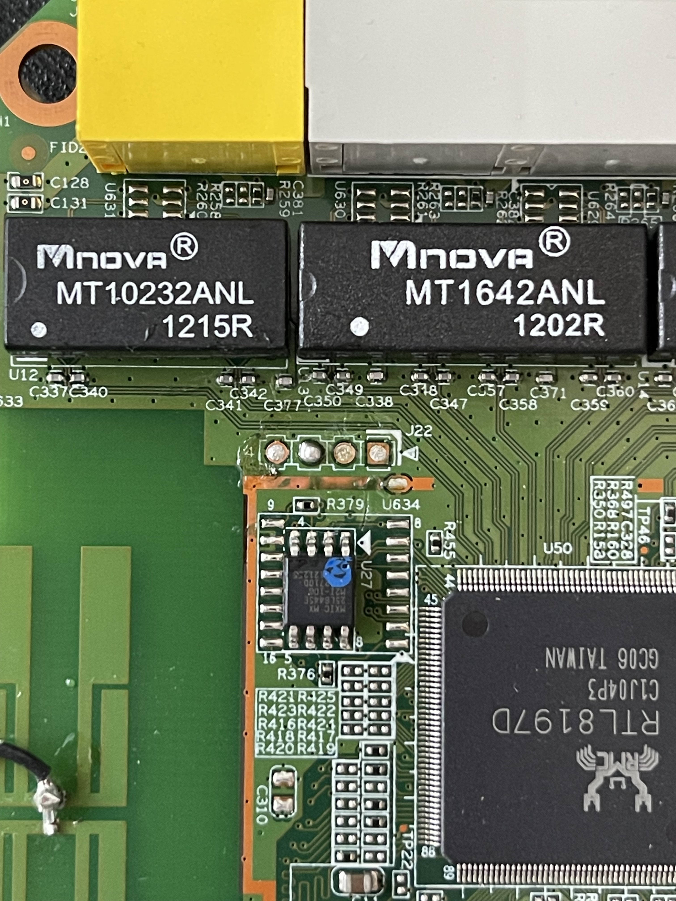
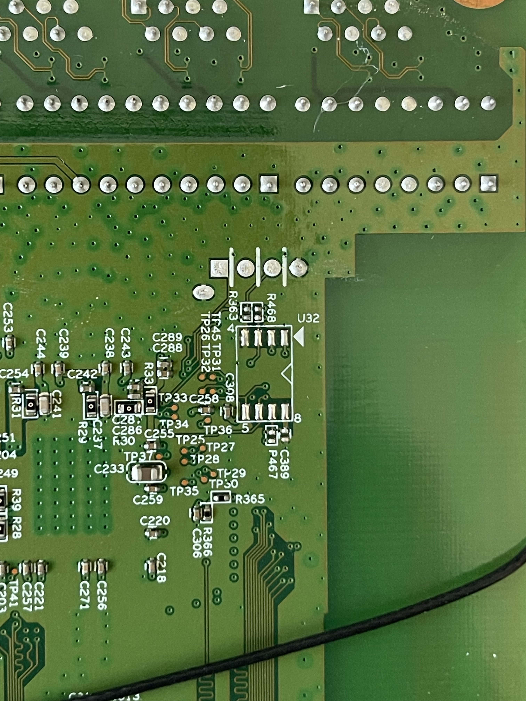
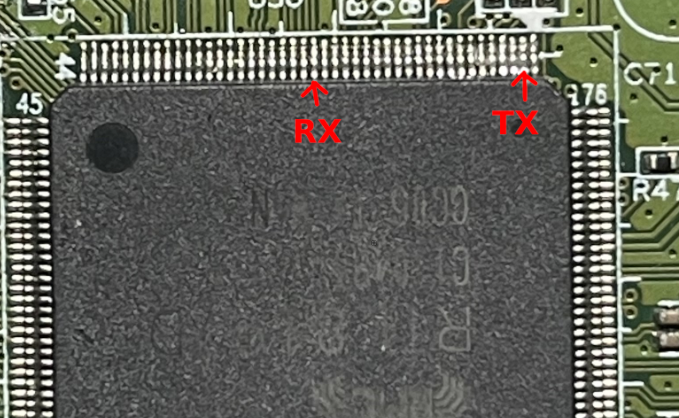
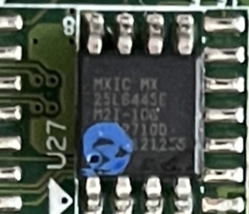
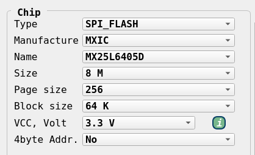
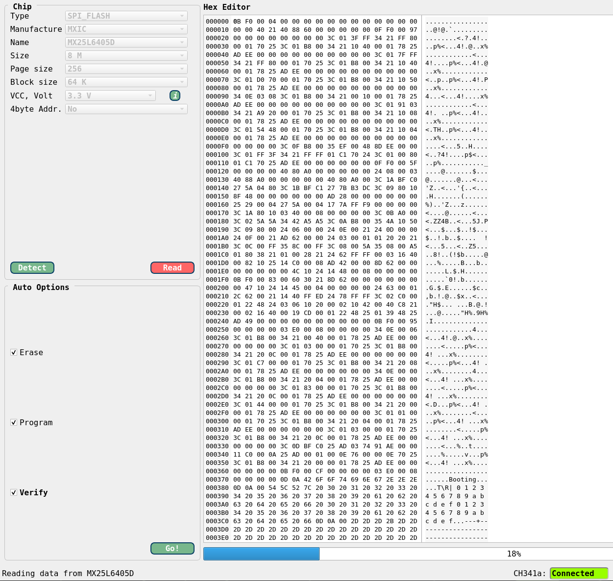
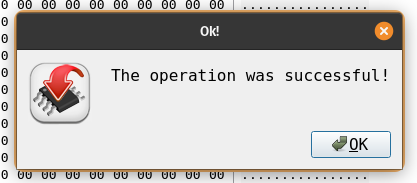

+++
title = 'IoT: Hacking on a Budget (part 2) - Belkin N450'
date = 2025-04-18T21:22:05-04:00
draft = false
+++

<h1 style="text-align:center">IoT Series: Hacking on a Budget - Part 2</h1>
<h2 style="text-align:center">The Overflashed Belkin N450</h2>
<br>
<div style="text-align:center"></div>
<br>
<hr style="height: 4px">

## Intro
Welcome back to the part two of my bargain thrift store hacking journey. This is the second router I managed to snag during my recent thrift store haul, and it was a good one. This one came with its own set of quirks and challenges that taught me new techniques. It built on my knowledge from the previous router; however, it ultimately ended in an unexpected, or expected given my lack of expertise, way. For $3, I can't complain as it was more than worth its price tag.

## OSINT
For this router, I pretty much only checked for other blog posts that may have talked about hacking this thing, but didn't find any. I didn't bother checking FCC filings as I was about to bust this baby open on my own anyway, so I saw no benefit in doing so.

## Internals
The board itself was pretty simple and very exposed. There was no heat sinks or maskings. I spotted the UART connector immediately, convieniently located right above the SPI chip. So to spare you the details, I connected straight to it to see what the boot process looked like.

### UART
I landed on a baud rate of `38400` after some trial and error. The bootloader was not U-boot which posed a challenge in it of itself:

```
*** baud: 38400 ***

Booting...

@@@@@@@@@@@@@@@@@@@@@@@@@@@@@@@@@@@@@@@@@@@@@@@@@@@@@@@@@@@@@@@@@@@@@@@@@@@@@@@@
@
@ chip__no chip__id mfr___id dev___id cap___id size_sft dev_size chipSize
@ 0000000h 0c22017h 00000c2h 0000020h 0000017h 0000000h 0000017h 0800000h
@ blk_size blk__cnt sec_size sec__cnt pageSize page_cnt chip_clk chipName
@ 0010000h 0000080h 0001000h 0000800h 0000100h 0000010h 000004eh MX25L6405D
@
@@@@@@@@@@@@@@@@@@@@@@@@@@@@@@@@@@@@@@@@@@@@@@@@@@@@@@@@@@@@@@@@@@@@@@@@@@@@@@@@

---RealTek(RTL8196D)at 2012.04.06-19:46+0800 v0.1 [16bit](579MHz)
no sys signature at 00010000!

[check_system_image] addred [0x05010000] ret [0]!!!!!!!!!!!!!!

[check_system_image] addred [0x05020000] ret [2]!!!!!!!!!!!!!!
no rootfs signature at 000F0000!
no rootfs signature at 00130000!
no rootfs signature at 00170000!
no rootfs signature at 00110000!

<...snip...>
```

After dumping out the entire boot log for review purposes, I rebooted the device and tried to interact with it over UART; however, I found that my inputs were not registering. I confirmed the Flipper was sending my keystrokes as it has a "TX" counter which kept incrementing bytes... So I tried to solder on the pin headers to see if I can get a better connection, but the result remained the same. Odd.

<div style="text-align:center"></div>

I figured the connection to the UART pinout may be bad, so I desoldered my headers and tried to trace the "RX" pin to its origin to see if I can tap directly into it. From the top view, the "RX" pin seemingly did not appear to be connected to anything.

<div style="text-align:center"></div>

The bottom view also did not show any traces going to the RX pin. I figured that the trace for the RC pin may be sandwiched on another layer of the PCB.

<div style="text-align:center"></div>

I then decided to trace the TX pin around the board using my multimeter set to continuity testing. Its first stop was the R363 resistor, but then, due to the silkscreen, it was hard to say where the trace went next. So through brute force, I found where the TX pad connects to on the SOC. Then I did the same with the RX pin and found it connected to the SOC here:

<div style="text-align:center"></div>

<i>Note: I had to resort to brute force as I could not find any datasheets for this SOC. I found some references to it on Chinese websites but those required a valid Chinese number to register and gain full access to the PDF. Rent-a-number sites did not work for this, so I moved on defeated.</i>

Knowing the RX pin is actually live, I tried tapping into the UART from underneath the PCB in case something weird was happening top-side.

<div style="text-align:center"></div>

Still nada, the device was not recognizing my inputs. Next, I returned to the top-side of the PCB and tried to glitch the firmware by first grounding the CS pin. I attached a clip to it and a Dupont cable that I then tapped to a ground pad located on the perimeter of the board.

<div style="text-align:center"></div>

Doing so straight out of the gate during the boot process seemed to work and caused a whole bunch of errors, ultimately ending on a new message, `In Httpdownload...`:
```
Booting...

@@@@@@@@@@@@@@@@@@@@@@@@@@@@@@@@@@@@@@@@@@@@@@@@@@@@@@@@@@@@@@@@@@@@@@@@@@@@@@@@
@
@ chip__no chip__id mfr___id dev___id cap___id size_sft dev_size chipSize
@ 0000000h 0ffffffh 00000ffh 00000ffh 00000ffh 0000017h 0000016h 0400000h
@ blk_size blk__cnt sec_size sec__cnt pageSize page_cnt chip_clk chipName
@ 0010000h 0000040h 0001000h 0000400h 0000100h 0000010h 0000027h UNKNOWN
@
@@@@@@@@@@@@@@@@@@@@@@@@@@@@@@@@@@@@@@@@@@@@@@@@@@@@@@@@@@@@@@@@@@@@@@@@@@@@@@@@

---RealTek(RTL8196D)at 2012.04.06-19:46+0800 v0.1 [16bit](579MHz)
no sys signature at 00010000!

[check_system_image] addred [0x05010000] ret [0]!!!!!!!!!!!!!!
no sys signature at 00020000!

[check_system_image] addred [0x05020000] ret [0]!!!!!!!!!!!!!!
no sys signature at 00030000!

[check_system_image] addred [0x05030000] ret [0]!!!!!!!!!!!!!!
no sys signature at 00021000!

<...snip...>

[check_system_image] addred [0x0505f000] ret [0]!!!!!!!!!!!!!!
no sys signature at 00060000!

[check_system_image] addred [0x05060000] ret [0]!!!!!!!!!!!!!!
Scanning Flash Section 0...
Scanning Flash Section 1...
Flash Sector Number : 128.
P0phymode=01, embedded phy

In Httpdownload...
```

The status LED on the router was also flashing blue and red. However, the device was still refusing to accept any of my input. So next I tried to ground the serial data output pin, which generated all kinds of errors, all depending on when I decided to trigger the glitch. Here's an example of an error this caused:
```
<...snip...>

CPU 0 Unable to handle kernel paging request at virtual address c002149d, epc == 800bacf0, ra == 800bac80
Oops[#1]:
Cpu 0
$ 0   : 00000000 10000400 00020000 fffe0e28
$ 4   : c002149d fffe0000 00000002 00000000
$ 8   : c01b6644 c01b6678 81014198 00000000
$12   : 802d19dc 00080000 00080000 ffffffff
$16   : 000002c5 0000000a c0022000 c01b6000
$20   : 00d40e28 81677abc 00000000 01000000
$24   : 00000008 8003d9a4
$28   : 81670000 81677a90 0006d420 800bac80
Hi    : 00000000
Lo    : 02909fff
epc   : 800bacf0 0x800bacf0
    Tainted: P
ra    : 800bac80 0x800bac80
Status: 10000404    IEp
Cause : 40000008
BadVA : c002149d
PrId  : 0000dc02 (<NULL>)
Modules linked in: ipv6_br ipt_ip(P) ipt_mac(P) ipt_REJECT ipt_http_string(P) led_hw(P) led_pb_api(P)
Process sh (pid: 395, threadinfo=81670000, task=8165fcd0, tls=00000000)
Stack : 00000020 80004ae0 00000000 80000420 00000002 0000002f 0000001e 5d000200
        00000000 00000200 00000000 800b9e9c c000010d c0000000 c000a8cd 0000a8cd
        0268fef3 02909fff 02909fff ffffffff 00000000 065de3c8 c0000000 00000001
        00009c67 00000003 000000b1 00000000 00000003 c01b6644 c01b6a68 c01b6664
        00000005 c01b6678 c01b6644 00000000 00000008 80084660 802f0000 8156c800
        ...
Call Trace:[<80004ae0>] 0x80004ae0
[<80000420>] 0x80000420

<...snip...>
```

Ultimately, the glitching did not get me into a different shell or into a mode where my input was being accepted.

Althought not described here very well, in between each of the above-mentioned steps were hours spent Googling around trying to find an explanation as to what may be going on. The most dissatisfying answer I found was that manufacturers sometimes disable the RX pin to prevent tampering through UART. I found no information as to how to re-enable it. As I've mentioned before, this router was not running U-boot, and most of the online helpe surrounded that topic almost exclusively. As such, I was on my own... but not entierly. I turned to the IoT Hacker Hangout Discord to see if anybody else has seen this type of behavior from a device they worked on in the past, and while the fellow hackers said they did, they were unable to assist me despite their best efforts. As such, I decided to switch tactics and go after the SPI chip.

## SPI Chip
The SPI chip located just south of the UART pads listed its model as `MXIC MX 25L6445E`:

<div style="text-align:center"></div>

Using this model number, I was able to quickly find a [datasheet](https://www.macronix.com/Lists/Datasheet/Attachments/8591/MX25L6445E,%203V,%2064Mb,%20v1.8.pdf) for it. Then, to dump the firmware stored on it, I could have tapped into the chip pins themselves using my probes, but I ended up resorting to the use of an 8-pin SPI chip clip along with my CH341a programmer (BOY was this a mistake, little foreshadowing for you).

<div style="text-align:center"></div>

To interact with the programmer, I used the [IMSProg](https://github.com/bigbigmdm/IMSProg) utility. For some reason, I was unable to read the chip without supplying power to the board, but once I gave it juice, `IMSProg` was able to automatically detect the chip model and all related parameters:

<div style="text-align:center"></div>


Afterwards, I simply hit "Read" and had it extract the firmware.

<div style="text-align:center"></div>

I saved the firmware to a file and let `binwalk` do its thing:
```
# binwalk -e spi_chip-dump.bin

DECIMAL       HEXADECIMAL     DESCRIPTION
--------------------------------------------------------------------------------
4896          0x1320          LZMA compressed data, properties: 0x5D, dictionary size: 8388608 bytes, uncompressed size: 122992 bytes
65466         0xFFBA          Sercomm firmware signature, version control: 256, download control: 0, hardware ID: "ADN", hardware version: 0x0, firmware version: 0x9, starting code segment: 0x0, code size: 0x7308
141336        0x22818         LZMA compressed data, properties: 0x5D, dictionary size: 8388608 bytes, uncompressed size: 3063860 bytes
1441792       0x160000        Squashfs filesystem, little endian, version 4.0, compression:lzma, size: 2161593 bytes, 870 inodes, blocksize: 131072 bytes, created: 2038-07-30 03:14:08
```

Binwalk extracted the firmware along with the squashed file system, granting me access to everything the router had to offer.

At this point, I spent several hours browsing through the firmware to see if I can find anything that enables UART input, but was unsuccessful. As such, my next step was: MODSSSS.

### Modifying Firmware
To modify the firmware, I first referenced back to my `binwalk` output so that I can take note of where the squashfs filesystem resided.
```
1441792       0x160000        Squashfs filesystem, little endian, version 4.0, compression:lzma, size: 2161593 bytes, 870 inodes, blocksize: 131072 bytes, created: 2038-07-30 03:14:08
```

`Binwalk` told me the file system started from 1441792 bytes and since it was the last file, I did not need to worry about its size. To extract just this portion from the firmware dump, I used `dd`:
```
# dd if=spi_chip-dump.bin bs=1 skip=1441792 of=fs.sqsh
6946816+0 records in
6946816+0 records out
6946816 bytes (6.9 MB, 6.6 MiB) copied, 4.34644 s, 1.6 MB/s

# file fs.sqsh
fs.sqsh: Squashfs filesystem, little endian, version 4.0, lzma compressed, 2161593 bytes, 870 inodes, blocksize: 131072 bytes, created: Fri Jul 30 03:14:08 2038
```

The `file` command confirmed the same signature as found by `binwalk`, indicating the dump was intact. Next, since this was a squashfs file system, I unpacked it with `unsquashfs`:
```
# sudo unsquashfs -no-wild fs.sqsh
Parallel unsquashfs: Using 2 processors
796 inodes (432 blocks) to write

[=====================================================================================================================================================================================|] 1228/1228 100%

created 405 files
created 74 directories
created 105 symlinks
created 286 devices
created 0 fifos
created 0 sockets
created 0 hardlinks

# ls squashfs-root
bin  dev  etc  home  lib  linuxrc  mnt  proc  sbin  sys  tmp  usr  var  www
```
<i>Note: I ran this with `sudo` permissions to make sure all the symlinks are created. I wouldn't recommend doing this on a system that you care about. I used a VM to do so</i>

From my many-hour analysis of the file system, I found that the `/etc/inittab` file executed the router's OS(?) (as expected). It did so by running `/etc/rcS`. Here's an excerpt from `inittab`:
```
cat squashfs-root/etc/inittab
::sysinit:/etc/rcS
::respawn:/bin/sh
```

The `rcS` script ran the `/sbin/rc init` command:
```
# cat squashfs-root/etc/rcS
#!/bin/sh

#  mount filesystem from fstab
mount -a

#######################################
# Init                                #
#######################################
export PATH=/sbin:/bin:/usr/sbin:/usr/bin:/usr/sbin/scripts

UTC=yes

# build var directories
/bin/mkdir -m 0777 /tmp/var
/bin/mkdir -m 0777 /tmp/var/run
/bin/mkdir -m 0777 /var/lock
/bin/mkdir -m 0777 /var/log
/bin/mkdir -m 0777 /var/run
/bin/mkdir -m 0777 /var/tmp
/bin/mkdir -m 0777 /tmp/ppp
/bin/mkdir -m 0777 /tmp/l2tp

# check if nvram crc error, restore to default
/sbin/rc init
```

My thought was that maybe, just maybe, if I didn't let the OS boot I could get some input action. So to try this out, I replaced the `::sysinit:/etc/rcS` line in `inittab` to `::sysinit:/bin/sh`. With this change, the router should go into a shell rather than into a system boot. 

With this modification made, I now had to reconstruct the firmware so that I can write it back onto the SPI chip. First, I repackaged the `squashfs` file system using the `mksquashfs` command:
```
# mksquashfs squashfs-root newrootfs.bin -comp lzma
Parallel mksquashfs: Using 2 processors
Creating 4.0 filesystem on newrootfs.bin, block size 131072.
[=======================================================================================================================================================================================-] 432/432 100%

Exportable Squashfs 4.0 filesystem, lzma compressed, data block size 131072
	compressed data, compressed metadata, compressed fragments,
	compressed xattrs, compressed ids
	duplicates are removed
Filesystem size 2105.78 Kbytes (2.06 Mbytes)
	23.94% of uncompressed filesystem size (8796.46 Kbytes)
Inode table size 5000 bytes (4.88 Kbytes)
	18.99% of uncompressed inode table size (26324 bytes)
Directory table size 6086 bytes (5.94 Kbytes)
	40.17% of uncompressed directory table size (15150 bytes)
Number of duplicate files found 64
Number of inodes 870
Number of files 405
Number of fragments 39
Number of symbolic links 105
Number of device nodes 286
Number of fifo nodes 0
Number of socket nodes 0
Number of directories 74
Number of hard-links 0
Number of ids (unique uids + gids) 3
Number of uids 2
	unknown (1004)
	root (0)
Number of gids 3
	unknown (1004)
	root (0)
	tty (5)
```

You'll notice that I added the `-comp lzma` argument. This is so that the compression method of my modified file system matches that of the source one. If you are wondering where I got this information from, take a look at the file signature of the original squashfs bin dump, it contained `, compression:lzma,`.  I compared the two file signatures to make sure everything looked alright:
```
# file newrootfs.bin
newrootfs.bin: Squashfs filesystem, little endian, version 4.0, lzma compressed, 2156316 bytes, 870 inodes, blocksize: 131072 bytes, created: Tue Apr 15 14:21:52 2025

# file fs.sqsh
fs.sqsh: Squashfs filesystem, little endian, version 4.0, lzma compressed, 2161593 bytes, 870 inodes, blocksize: 131072 bytes, created: Fri Jul 30 03:14:08 2038
```

The newly created fs was just slightly smaller, but that was not a problem. Next, I created a copy of my `spi_chip-dump.bin` and proceeded to write my modified fs to it:
```
# cp spi_chip-dump.bin newfw.bin
# dd if=newrootfs.bin of=newfw.bin seek=1441792 bs=1 count=2161593 conv=notrunc
2158592+0 records in
2158592+0 records out
2158592 bytes (2.2 MB, 2.1 MiB) copied, 1.3531 s, 1.6 MB/s
```

The `dd` command employed the `seek=` argument telling it to start writing from the location of the original squashfs file system, `count=` which told it the max number of blocks to write (this technically did not need to be specified as the fs was the last thing in the firmware file and would not overwrite any following data, but I added it just in case), `conv=notrunc` tells it to preserve the existing data within the output file and only overwrite specified parts of it.

To confirm my changes were applied as expected, I ran the `newfw.bin` file through `binwalk`. The only difference in output was the size of the squashfs partition, as expected.
```
# binwalk newfw.bin

DECIMAL       HEXADECIMAL     DESCRIPTION
--------------------------------------------------------------------------------
4896          0x1320          LZMA compressed data, properties: 0x5D, dictionary size: 8388608 bytes, uncompressed size: 122992 bytes
65466         0xFFBA          Sercomm firmware signature, version control: 256, download control: 0, hardware ID: "ADN", hardware version: 0x0, firmware version: 0x9, starting code segment: 0x0, code size: 0x7308
141336        0x22818         LZMA compressed data, properties: 0x5D, dictionary size: 8388608 bytes, uncompressed size: 3063860 bytes
1441792       0x160000        Squashfs filesystem, little endian, version 4.0, compression:lzma, size: 2156316 bytes, 870 inodes, blocksize: 131072 bytes, created: 2025-04-15 14:21:52
```

The only thing left was to clip the SPI chip back on with my CH341A and reflash it with the new firmware. I loaded my `IMGProg` back up and hit "Detect" to make sure the chip is being read appropriately. Then, I hit "File > Open", selected my new firmware file, and used the "Auto Options" to wipe the chip, write new data, and validate.

<div style="text-align:center"></div>

The only thing left was to hook up the router back to my Flipper and monitor the boot process to ensure nothing broke and to see if the firmware modification worked... and indeed it did!
```
<...snip...>

NET: Registered protocol family 17
Netlink[Kernel] create socket for igmp ok.
VFS: Mounted root (squashfs filesystem) readonly on device 31:2.
Freeing unused kernel memory: 104k freed
init started:  BusyBox v1.1.0 (2012.06.06-06:44+0000) multi-call binary
Starting pid 17, console /dev/console: '/bin/sh'


BusyBox v1.1.0 (2012.06.06-06:44+0000) Built-in shell (ash)
Enter 'help' for a list of built-in commands.

~ #
```

Instead of booting up, the router went straight into the root shell; however, still no input... womp womp womp. But at least I've reached a LENGTHY method of (potential) command execution.

I tried to make another modification to  `inittab` to have it print out the `/etc/shadow` file. I also added a command to potentially spawn a serial connection:
```
::sysinit:/bin/sh && /bin/cat /etc/shadow
::respawn:/bin/sh
ttyS0::askfirst:/bin/sh
```

This is where my downfall began. Whilst trying to flash my new firmware onto the chip, my SPI clip slipped off mid write. I tried to get it back on but never could. It turned out that the clip was worn out and could no longer latch onto the chip. I tried several other methods of getting data onto the chip using individual pin clips, even tried probing it with my PIZZAbite, but no luck. Ultimately, I had to wait several days for my new clips to get here so I can try again.

When I got the new clips, my CH314A stopped working. GREAT! But, the bus pirate still worked fine so I could use that instead. This is when I found out... The chip was fried. Reading from the chip would halt randomly around 10-15%, write was no longer possible. I killed it!

At this point you may be asking yourself, "why didn't he just remove the chip and flashed it like a proper human would". Well the answer to that is: I didn't have a rework station just yet. I still do not, but it is now on my list of things to buy next. I managed to pop the chip off using my soldering iron, but this came at a price...

<div style="text-align:center"></div>

Ope! Lost one of the pads :,)

Without a microscope, this repair would be painful. As such, I am calling it quits here. For its price the router has done its job!

## Closing Thoughts
Well, first off, GET A REWORK STATION. This would have been a much more trivial job if I had one. But one has to learn the hardship of not having one to learn the real value of having it. But this was my intro into firmware modification which I got really excited for. If you have any thoughts about my process here, and I am sure you have many improvement suggestions, please send them over through whatever channel works for you. The lack of UART input still bugs me and I wish I had figured out what caused it and how to bypass it in the future. For now, that shall remain a mystery.

I have two more routers left in this series, although I already started working on the 3rd and I might be skipping that one for now. Simply beacuse it's another custom bootloader and the flash is unattainable for now. Look out for the next one!

Pce.
