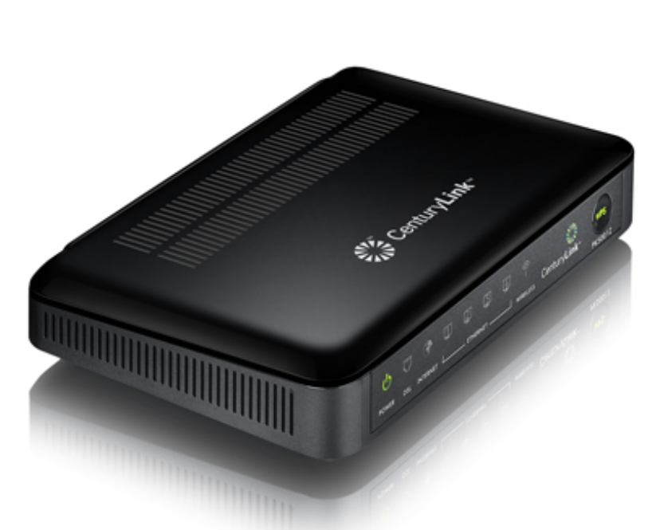
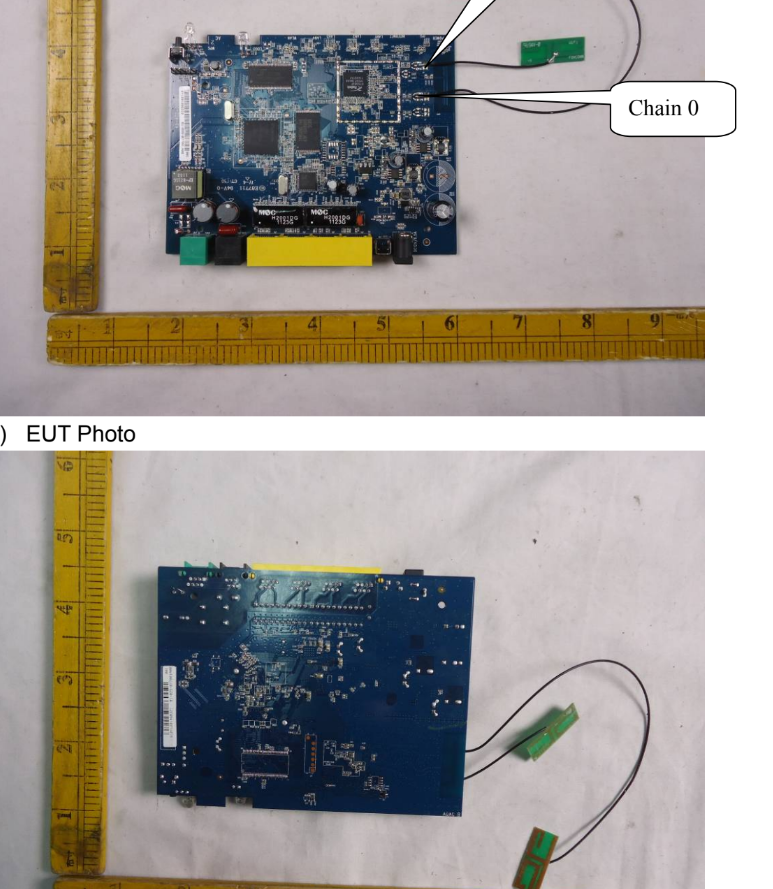
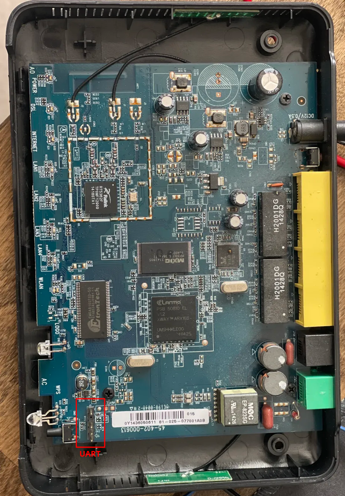
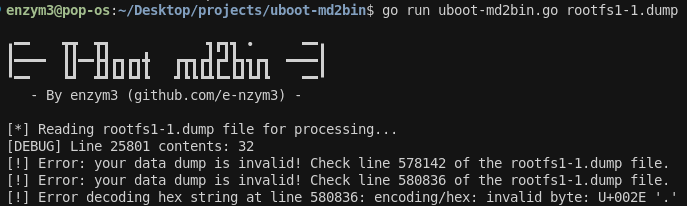
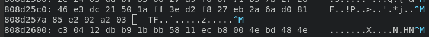
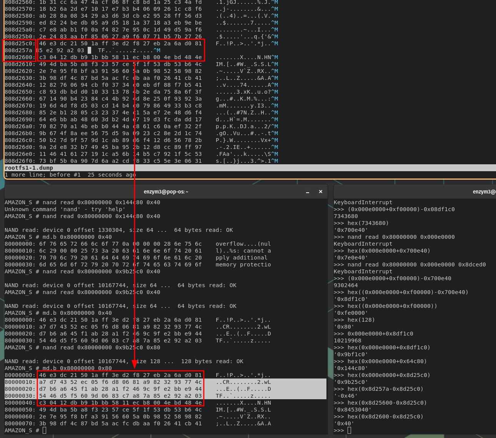
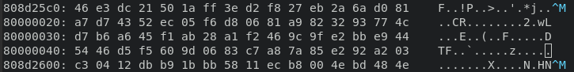
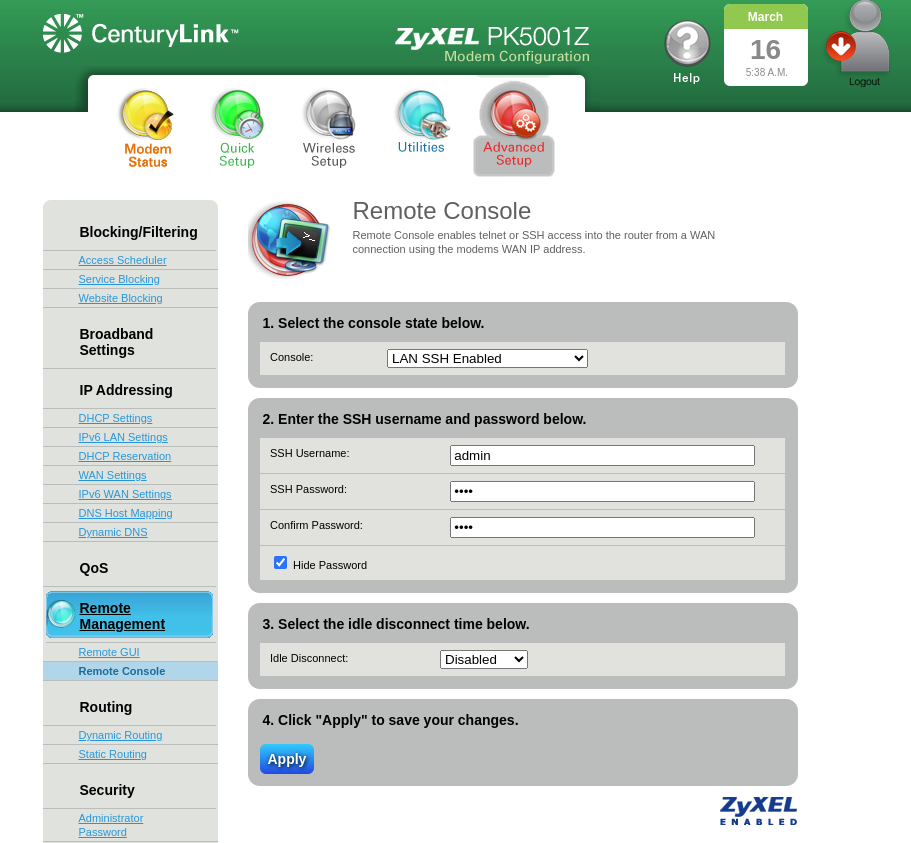

+++
title = 'IoT: Hacking on a Budget (part 1) - CenturyLink PK5001A Router'
date = 2025-04-12T19:50:05-04:00
draft = false
+++

<h1 style="text-align:center">IoT Series: Hacking on a Budget - Part 1</h1>
<h2 style="text-align:center">Cheap Fun with a CenturyLink PK5001A Router</h2>
<br>
<div style="text-align:center"></div>
<br>
<hr style="height: 2px">
## Intro
Welcome to a new series I will be starting as I practice and learn the craft of IoT hacking. It's been a long time coming for me. I always entertained the idea of getting into hardware hacking as I love the tactile feel of it all. Ever since I was a kid I used to love taking apart old electronics. I remember I had a drawer full of "garbage" electronics that I would salvage from breaking down old printers and mobos. Had a large collection of "barrels" (as I used to call them), nowadays commonly known as capacitors, which I sheered off with pliers. It was a great activity for an impatient, ADHD young me.

Anyway, I've taken one course on hardware hacking, the SANS SEC556 (which was OK), but most of my newbfoo came from watching YouTube channels, such as the legendary [Matt Brown](https://www.youtube.com/@mattbrwn). This was enough to get me familiar with the basics. It was certainly enough to get me started and confident enough to take apart a piece of hardware and find something fun to do with it. As such, my journey begins.

I semi-recently found myself in a local thrift shop looking for old hardware to practice on. The Goodwills around me tend to be pretty picked through; however, there will occasionally be an older router for $20-30. To me, that's a price of a brand new piece of hardware that I can pick up from Amazon, I needed something cheaper. The local thirft shop turned out to be a gold mine. They had 4 routers, with power cables, which I walked out with for a whopping.... $8. YEP. And so, here's my journey with the first router, which was quite a learning experience. While things seemed to fall into place at the beginning, I ended up hitting a wall more than once. Ultimatley, the try harder mentality got me what I was looking for: root shellz. Let's dive in!

## OSINT
Before I even cracked the case open... (who am I kidding, the case was already open and I already lost two screws, but for the sake of the story, stick with me) I started with conducting OSINT like a good pentester should. The sticker on the bottom of the router revealed its FCCID, `I88PK5001Z`, which I searched up on [fccid.io](https://fccid.io/I88PK5001Z). The FCC filing for the device came with detailed images of the board, which let me peep at the device without having to open it up:

<div style="text-align:center"></div>

The pictures were a littler grainy, but upon a closer look, I noticed the potential UART headers in the right upper corner of the board. The FCC filing did not have any other useful information, so I jumped straight into cracking this thing open.

## Cracking the Case
Having unscrewed a handful of screws, the case popped open with ease thanks to my pry tools. After removing the top cover, sure enough, there was the UART as pictured in the FCC filing:

<div style="text-align:center"></div>

The only thing left was to probe the pins with my multimeter to determine: the ground pin, transmit pin (TX), and receive pin (RX). If you are unfamiliar with the UART protocol, I recommend you ask your favorite AI or read through this article: [UART basics](https://www.circuitbasics.com/basics-uart-communication/). In essence, you can find the ground pin by probing around pads and pins on the board while having your multimeter set to continuity testing. If you have a multimeter that beeps when continuity is detected, that'll tell you when you found your ground pin. Most of the time, you can find ground contact on certain shielding for chips, or clearly designated "GND" contacts on the board. 

Through an educated guess, I found the ground pin to be the pin that was separated from the other 3 pins (the top pin as pictured). To find the transmit pin, I read the voltage of the remaining three pins and looked for one that flactuated between 3.3V and a lower voltage, jumping back and forth. This effectively told me that there's data being sent on the pin, thus making it the TX pin. The TX pin ended up being the second pin from the bottom as pictured above. For the RX pin, I made an educated guess and figured it would be the third pin from the bottom, as the VCC 3v pin usually resides on the edges of t he pinout, and I was correct.

## UART Access
Having identified my UART pins, I plugged them into my Flipper's GPIO pins (reversing TX and RX with RX and TX on the Flipper), and I used the flipper as my serial bridge. I assumed a baud rate of 112500 and sure enough, I saw data. At this point, I powercycled the router to catch the whole boot sequence of the router. I won't include the full dump here, but I'll refrence to it when pertinent to explain what I'm talking about.

I noticed that as soon as the router booted up, there was an option to stop the boot process of u-boot by pressing `d`. Doing so landed me in a u-boot limited shell where I could only execute the following commands:
```
?       - alias for 'help'
askenv  - get environment variables from stdin
bootm   - boot application image from memory
cp      - memory copy
echo    - echo args to console
go      - start application at address 'addr'
help    - print online help
imls    - list all images found in flash
loadb   - load binary file over serial line (kermit mode)
loady   - load binary file over serial line (ymodem mode)
md      - memory display
mm      - memory modify (auto-incrementing)
mtest   - simple RAM test
mw      - memory write (fill)
nand    - NAND sub-system
printenv- print environment variables
reset   - Perform RESET of the CPU
run     - run commands in an environment variable
setenv  - set environment variables
switchup    - initialize switch
tftpboot- boot image via network using TFTP protocol
upgrade - forward/backward copy memory to pre-defined flash location
```

The goal at this point was to gain access to the firmware by dumping it. I haven't done many firmware dumps through UART at this point, but based on my assessment of these commands, it appeard that the key command to dump data was `md`. The `printenv` command also came in handy as it gave me information about the commands being executed at boot. I tried using the `md` command several times to see if I can extract any data, but every time I did so, the device would simply reboot. 

At first I thought there may have been something corrupted on the device, but after playing around with it more, I found that the device reboot seemed to coincide with exceptions caused by the commands I was running. For instance, executing the `md` command on a small section of RAM, the data would print with no problem. But if I tried reading larger chunks of data, or trying to read from unavailable RAM addresses, the device would reboot.

## Memory Dumping
Having identified the issue for the device reboots, I proceeded to dump data. The boot log presented the memory addresses of each parition:
```
Creating 8 MTD partitions on "ifx_nand":
0x000e0000-0x01ee0000 : "rootfs,kernel1"
0x01ee0000-0x03ce0000 : "rootfs,kernel2"
0x03ce0000-0x04760000 : "reserve"
0x04760000-0x07420000 : "firmware"
0x07420000-0x07ec0000 : "config"
0x07ec0000-0x07f00000 : "mrd_romd"
0x07f00000-0x07f40000 : "mrd_cert1"
0x07f40000-0x07f80000 : "mrd_cert2"
```

Given that I only had access to `nand` and `md` commands for dumping firmware, I had to calculate the size of data I wish to load into RAM and then dump it with `md`. It is worth noting that when investigating this shell, I found a boot command within the environment variables which loaded u-boot(?) into memory:
```
AMAZON_S # printenv

bootcmd=nand read 0x81a00000 0x0001B800 10000; go 0x81a00000
bootdelay=0
baudrate=115200
preboot=echo;echo set voltage;echo;mw.b 0xbf106a0b 7f

<...snip...>
```

The `nand` command usage (based on my research) worked as follows:
- `read` - tells the command to read data from NAND into RAM
- `0x81a00000` - starting RAM address at which the data will be written to
- `0x0001B800` - starting NAND address from which the data will be read from
- `10000` - amount of bytes to read from NAND

So technically, the data will exist within RAM from `0x81a00000` to `0x81a02710`. 

Within the boot sequence, I also noticed several outputs that suggested a lower RAM address of `0x80800000` may be used:
```
## Booting image at 80800000 ...
```

Due to this, I assumed I would be good to start loading data starting from the RAM address `0x80000000`. I tested this to be the case by modifying the command from `bootcmd` to have it write starting from `0x80000000` and it worked fine.

Having put together the first piece of my RAM write command (`nand read 0x80000000`) I now needed to calculate the size of the first `rootfs,kernel1` partition so I can load it up. Python to the rescue in this case:
```
# python3

>>> hex(0x01ee0000-0x000e0000)
'0x1e00000'
```

The size of the partition was `0x1e00000`, or 31,457,280, bytes (~31 MB). Now I had the full command: `nand read 0x80000000 0x000e0000 0x1e00000`. However, after executing this command, the device rebooted once again. So I tried to halve the data I was reading into RAM to see if that made a difference and it did! Here is the final command I ended up using to read the first half of `rootfs,kernel1` partition into RAM: `nand read 0x80000000 0x000e0000 0xf00000` with `0xf00000` being half of `0x1e00000`:
```
AMAZON_S # nand read 0x80000000 0x000e0000 0xf00000

NAND read: device 0 offset 917504, size 15728640 ...  15728640 bytes read: OK
```

As you can see, the device spit out `read: OK` confirming successful load. Now, all I had to do is dump out the data, and by dump out I mean print it to screen... one byte at a time... And with 15,728,640 bytes to print (or 15 MB) it naturally took a while, about 2 hours. To do so, I ran the `md` command in the following manner: `md.b 0x80000000 0xf00000`. To catch all this output, I stood up my UART connection through `picocom` and the `--log rootfs1-1.dump` argument to save all the console output to the file.

I then repeated the process for the other half of the partition with `nand read 0x80000000 0x00fe0000 0xfe0000` and the same `md` command.  The `nand` command is different as I now wanted to start reading the partition from its half point, at `0x00fe0000` (which is its start memory address `0x000e0000` + the half size offset `0xf00000`).

With both halves dumped, I cleaned up the beginning and end of the files so that only the hex dump remained:

```
# head -n 5 rootfs1-1.dump
80000000: 00 00 00 03 00 00 00 01 ff ff 00 00 00 00 00 00    ................
80000010: 00 00 00 00 00 00 00 00 00 00 00 00 00 00 00 00    ................
80000020: 00 00 00 00 00 00 00 00 00 00 00 00 00 00 00 00    ................
80000030: 00 00 00 00 00 00 00 00 00 00 00 00 00 00 00 00    ................
80000040: 00 00 00 00 00 00 00 00 00 00 00 00 00 00 00 00    ................

# tail -n 5 rootfs1-1.dump
80efffb0: ff ff ff ff ff ff ff ff ff ff ff ff ff ff ff ff    ................
80efffc0: ff ff ff ff ff ff ff ff ff ff ff ff ff ff ff ff    ................
80efffd0: ff ff ff ff ff ff ff ff ff ff ff ff ff ff ff ff    ................
80efffe0: ff ff ff ff ff ff ff ff ff ff ff ff ff ff ff ff    ................
80effff0: ff ff ff ff ff ff ff ff ff ff ff ff ff ff ff ff    ................
```

Then I combined them into `rootfs1.dump`.

### Hex to Bin
To transform the hext into binary data, I tried using Matt Brown's `parse-uboot-dump.py` tool (found [here](https://github.com/nmatt0/firmwaretools/tree/master)) but the tool did not work as expected. I'll spare you the details, but in essence, my dump was slightly corrupted where not all lines were in the same `md.b` format. Picocom must have glitched out a few times during the dump process. 

To remedy this, I set off to write a new tool, which will hopefully help you in the future as well: [uboot-md2bin](https://github.com/e-nzym3/uboot-md2bin). I took inspiration from Matt's tool in terms of what it did (cleaned up the hex output, stripped it to just hex bytes, and translated the hex into bin), but I added several error checks that are performed prior to processing the file. This allowed me to ensure my large dumps (hehe...) were reliable for further processing. After running `uboot-md2bin` on the rootfs1 dump, I found that there were several places where the dump was missing data. 

<div style="text-align:center"></div>

Line 578142 was indeed broken:

<div style="text-align:center"></div>


Not only that, when I compared the memory offset values, it seemed that there were 64 bytes of data missing from offset `0x808d25c0` -> `0x808d2600`. Quick Python math helped out here:
```
# python3

>>> hex(0x808d2600-0x808d25c0)
'0x40'
>>> 0x40
64
```

To fix this gap I read into RAM the broken portion of the dump and dumped it again:
```
nand read 0x80000000 0x9b25c0 0x80
md.b 0x80000000 0x80
```

`0x9b25b0` in the above command is the starting point of the partiton + the address where the broken offset occurs. I chose `808d25c0` (which would be `0x8d25c0` after stripping off the RAM address `0x80000000`) and read 128 (`0x80`) bytes to make sure I get the section I need.

<div style="text-align:center"></div>

This wasn't the only place where the dump was bad. So, I decided to go back to my two half dumps as it would be easier to math out the memory locations I needed to restore (as I knew the starting addresses for each half).

Here's the fixed dump section:

<div style="text-align:center"></div>
*Note: the offsets will be incorrect as I just copied and pasted the data from the new dump. This will not matter as the `uboot-md2bin` program will fix the offsets for me anyway.*

I saved the dump, reran the tool, found the next broken portion, fixed it, and so on until it exported successfully. (I have since re-wrote the logic of the tool to find all broken sections at once instead of having to go through saving, then re-running, fixing...). Some of the missing sections were larger, so naturally I had to accommodate for the larger gaps in both of the commands I was using. *Note: when I got to processing the second half of the dump, `rootfs1-2.dump`, I realized the dump is just filled with `ff` , meaning it was empty. Therefore, I proceeded further with just the first half as my full dump.*

Eventually, running `uboot-md2bin` completed successfully without any issues:
```
# uboot-md2bin rootfs1-1.dump 

╻━━    ┳┳  ┳┓            ┓┏┓┓ •      ━━╻
┃━━━━  ┃┃━━┣┫┏┓┏┓╋   ┏┳┓┏┫┏┛┣┓┓┏┓  ━━━━┃
╹━━    ┗┛  ┻┛┗┛┗┛┗   ┛┗┗┗┻┗━┗┛┗┛┗    ━━╹
   - By enzym3 (github.com/e-nzym3) -

[*] Reading rootfs1-1.dump file for processing...
[*] Validating contents...
[*] Processing complete! Resulting file is: rootfs1-1_output.bin
```

Now it was time to binwalk!

### Rootfs1 Analysis
Binwalk detected a whole bunch of things within the dump, so I slapped on `-e` to see what's inside:
```
# binwalk -e rootfs1-1_output.bin

DECIMAL       HEXADECIMAL     DESCRIPTION
--------------------------------------------------------------------------------
0             0x0             YAFFS filesystem, big endian
393216        0x60000         ELF, 32-bit MSB MIPS64 shared object, MIPS, version 1 (SYSV)
475136        0x74000         ELF, 32-bit MSB MIPS64 shared object, MIPS, version 1 (SYSV)
849664        0xCF700         Unix path: /var/run/utmp
860068        0xD1FA4         Unix path: /etc/config/resolv.conf
937984        0xE5000         ELF, 32-bit MSB MIPS64 shared object, MIPS, version 1 (SYSV)
1007616       0xF6000         ELF, 32-bit MSB MIPS64 shared object, MIPS, version 1 (SYSV)
1012112       0xF7190         Base64 standard index table
1038336       0xFD800         ELF, 32-bit MSB MIPS64 shared object, MIPS, version 1 (SYSV)
1130496       0x114000        ELF, 32-bit MSB MIPS64 shared object, MIPS, version 1 (SYSV)
1179648       0x120000        ELF, 32-bit MSB MIPS64 shared object, MIPS, version 1 (SYSV)
1253376       0x132000        ELF, 32-bit MSB MIPS64 shared object, MIPS, version 1 (SYSV)
1273856       0x137000        ELF, 32-bit MSB MIPS64 shared object, MIPS, version 1 (SYSV)
1282048       0x139000        ELF, 32-bit MSB MIPS64 shared object, MIPS, version 1 (SYSV)
1298442       0x13D00A        Unix path: /etc/init.d/rcS
1304576       0x13E800        Executable script, shebang: "/bin/sh"
1307104       0x13F1E0        Unix path: /etc/init.d/rcS1 ]; then
1307141       0x13F205        Unix path: /etc/init.d/rcS1
1699840       0x19F000        ELF, 32-bit MSB MIPS64 executable, MIPS, version 1 (SYSV)
2653950       0x287EFE        Intel x86 or x64 microcode, sig 0x000020a4, pf_mask 0xc2af0000, 2000-13-08, rev 0x-3d510000, size 8192
3045854       0x2E79DE        bzip2 compressed data, block size = 100k
3068828       0x2ED39C        Copyright string: "Copyright (C) 1998-2007 Erik Andersen, Rob Landley, Denys Vlasenko"
3071244       0x2EDD0C        Unix path: /var/run/utmp
3073616       0x2EE650        Unix path: /var/spool/cron/crontabs
3074444       0x2EE98C        Unix path: /var/spool/cron/crontabs
3085308       0x2F13FC        Unix path: /var/lock/LCK..%s
3088152       0x2F1F18        Unix path: /lib/modules/modules.dep
3091252       0x2F2B34        HTML document header
3091323       0x2F2B7B        HTML document footer
3094240       0x2F36E0        Unix path: /var/run/udhcpc.%iface%.pid -i %iface%[[ -H %hostname%]][[ -c %clientid%]][[ -s %script%]

<...snip...>
```

Unfortunately, most of the items binwalk found dumped out as "data" files, and the yaffs image did not successfully extract. I tried using `yaffshiv` manually with some brute force arguments, to no avail. I was able to go through the extracted data by simply grepping through strings with `strings * | grep -i "<search_string>"` but I did not end up finding anything that would assist me in finding the firmware image or any credentials that could be further leveraged.

As such, I went back to my UART console and repeated the memory dumping process for the `rootfs,kernel2` partition.

### Rootfs2 Analysis
The binwalk extract of rootfs2 resembled that of rootfs1 and also did not extract any individual files; however, when grepping through the extracted data, I found several mentions of `admin_404Ao3Tel` user, in what appeared to be a function to update its password to `1234`:
```
# strings * | grep -i "admin_404"

	/bin/adduser -s /bin/sh -h /root -G root -D -S admin_404A03Tel && echo admin_404A03Tel:1234 | /sbin/chpasswd
admin_404A03Tel
/bin/deluser admin_404A03Tel 2> /dev/null
	/bin/adduser -s /bin/sh -h /root -G root -D -S admin_404A03Tel && echo admin_404A03Tel:1234 | /sbin/chpasswd
admin_404A03Tel
/bin/deluser admin_404A03Tel 2> /dev/null
	/bin/adduser -s /bin/sh -h /root -G root -D -S admin_404A03Tel && echo admin_404A03Tel:1234 | /sbin/chpasswd
admin_404A03Tel
```

This user also appeared during the router's boot sequence with a prompt indicating an update to its password, likely as a result of the commands above:
```
<...snip...>

adduser: /root: File exists
Password for 'admin_404A03Tel' changed
Mar 16 04:20:24 ccc_be: cccRdmSearchObjNodeByName(): cannot find

<...snip...>
```
[
I attempted to log in with these credentials to the router, to no avail. Furthermore, the router's boot sequence also mentions updates to passwords of `root` and `admin_404A03SSH`: 
```
<...snip...>

socket: Address family not supported by protocol
socket: Address family not supported by protocol
Password for 'root' changed
error reading input file
adduser: /root: File exists
Password for 'admin_404A03SSH' changed
DSL[00]: ERROR - Function is only available in the SHOWTIME!
DSL[00]: ERROR - Function is on

<...snip...>
```

While the rootfs dumps did not contain any mentions of such actions against these two accounts, it led me to believe there may be a way to reveal the actual passwords being set for both of these accounts with a little bit of extra digging. Ultimately, I came out empty handed. After hours of digging through the dumps, I started to lose hope, but I remembered something that I should have checked in the first place: THE WEB PORTAL! 

## Web Portal
Every router comes with a configuration portal accessible through its private IP address (http://192.168.0.1/ in my case). I plugged my laptop into the router, obtained an IP address on the local subnet, and went ahead to log into the web portal using the credentials provided by the router's label.

After logging in, under the "Advanced Setup" menu, I found an option to enable SSH remote console access to the router. I enabled it and changed the admin account's password to `admin`. 

<div style="text-align:center"></div>

While doing so, I had my UART serial console up, within which I noticed a previously detected prompt from the initial boot sequence, `Password for 'admin_404A03SSH' changed`. BINGO! This web potal feature let me control one of the users I was after! I hopped back into the serial console and tried to login as the `admin_404A03SSH` user using the newly configured password. Lo and behold, I was in!!
```
<..snip...>

deluser: can't find admin_404A03SSH in /etc/group
deluser: /etc/gshadow: No such file or directory
adduser: /root: File exists
Password for 'admin_404A03SSH' changed

PK5001Z login: admin_404A03SSH
Password: 

$ whoami
admin_404A03SSH

$ pwd
/root
$ ls
fw       voip_fw
```

## Shell Access
Having attained shell access, I tried to first list out the contents of the `shadow` file to see what is there and if there are any other user's whose password hashes I can steal and potentially crack. However, upon trying to do so, I got a permission denied error.

```
$ cat /etc/shadow
cat: can't open '/etc/shadow': Permission denied
```

Hmmm... so I then listed out the `passwd` file, which worked (naturally), and here I learned there's a few other users I might be able to attack, such as `admin` and obviously `root`:
```
$ cat /etc/passwd
root:x:0:0:root:/root:/bin/sh
lp:x:7:7:lp:/var/spool/lpd:/bin/false
nobody:x:99:99:nobody:/nonexistent:/bin/false
admin:x:500:500:admin:/home/admin:/bin/sh
user:x:501:501:user:/home/user:/bin/sh
admin_404A03Tel:x:1:1:Linux User,,,:/root:/bin/sh
admin_404A03SSH:x:2:2:Linux User,,,:/root:/bin/sh
```

I tried `su` to other users but unfortunately this failed. I searched through the files in other user directories, some of which contained `config.rom` files but these did not contain any interesting details.

Further enumeration led me to the `/mnt` directory where I found the `NAND` folder.
```
$ ls /mnt
Config    Data      NAND      firmware  preNAND

$ ls /mnt/NAND
bin      e-data   i-data   lib      mnt      sbin     sys      var
com      etc      include  linuxrc  proc     script   tmp
dev      home     info     man      root     share    usr
```

Score! This looked like a copy of the file system stored in NAND. With that being the case, the same permissions would not apply there as in the live system, and I was right. Nothing stopped me from accessing the `etc` directory there:
```
$ pwd
/mnt/NAND/etc

$ ls
Wireless         dropbear         mdev.conf        services
ZLD_Config.sh    dsl_api          mini_httpd.conf  shadow
Zy_Private       fstab            mini_httpd.pem   shadow.default
applist          fw_env.config    mycert           shells
crontab          group            nsswitch.conf    ssl
dhcp.bound       iface.map        passwd           sysconfig
dhcp.deconfig    igmpproxy.conf   ppp              syslog-ng
dhcp.leasefail   init.d           profile          upnpd.conf
dhcp.renew       inittab          pure-ftpd        wide-dhcpv6
dhcp.script      l7-protocols     radvd.conf       zyfwupgrade
dnsmasq          linuxigd         resolv.conf
dnsmasq.leases   logrotate.d      rip
```

Including the `shadow` file which gave me access to the user's password hashes:
```
$ cat shadow
root:$1$lCu1EmHM$dGWmwYC6TyY9hebi0UjZk1:13013:0:99999:7:::
lp:*:13013:0:99999:7:::
nobody:*:13013:0:99999:7:::
admin:$1$$iC.dUsGpxNNJGeOm1dFio/:13013:0:99999:7:::
user:$1$$iC.dUsGpxNNJGeOm1dFio/:13013:0:99999:7:::
```

First thing I tried was to search these hashes on the internet in case they represented some default values that have already been cracked by someone. Turns out `$1$$iC.dUsGpxNNJGeOm1dFio` stood for `1234`. Which is something I've already found when analyzing the `rootfs2` parition dump! So I tried to `su` as `admin` and sure enough, it worked:
```
$ su admin
Password:

$ whoami
admin
```

But `admin` still did not have sufficient permissions to access the live system's `/etc` directory, and root access is what I am ultimately after. The next thing left to try was to crack the root's password. Shortly after launching `hashcat`, the password cracked to `1234` as well. Hmm... But that password didn't work with `su`. At this point I remembered that there was a prompt during boot that indicated the root's password was changed:
```
<...snip...>
socket: Address family not supported by protocol
Password for 'root' changed
error reading input file
<...snip...>
```

I decided to reboot the router and observe the boot process again. However, this time I noticed something very, very interesting when pressing enter the whole way through boot. There was a login prompt that appeared prior to the system finishing its boot that displayed a different login prompt: 
```
<...snip...>
br0: port 1(eth0.10) entering disabled state

(none) login:
(none) login:
(none) login: 
=======================================
resetAllPPPDUnitNumberStatus():
pppdUnitNumberInUsed[0]=0
pppdUnitNumberInUsed[1]=0
pppdUnitNumberInUsed[2]=0
pppdUnitNumberInUsed[3]=0
pppdUnitNumberInUsed[4]=0
pppdUnitNumberInUsed[5]=0
pppdUnitNumberInUsed[6]=0
pppdUnitNumberInUsed[7]=0
=======================================
<...snip...>
```

The `(none) login:` suggested to me that this prompt was pre-router's config. Which meant, whatever was originally in the firmware, should still be there. WHICH meant, the root password could still be `1234` prior to being reset during the later portion of the boot, as I've shown earlier. As such, I rebooted the router once more, and this time tried to authenticate as root when the `(none)` login prompt popped up. The result was..... ROOOOOOOT:
```
(none) login: root

<...snip...>

Password:

# whoami
root

# ls /mnt/Config
WLAN        lost+found  tr069
```

HA! I caught the router with its pants down and could now reset the root password to whatever I wished. Great success!

## Closing Thoughts
I learned quite a few lessons here, some that I probably should have already known, such as checking the router's portal first. I was too eager to go in and dump the firmware through UART that I forgot that basic step. But nonetheless, doing so led me on a path to learn some very interesting memory interaction methods and to develop the [uboot-md2bin](https://github.com/e-nzym3/uboot-md2bin) tool. Can't complain. As the famous Bob Ross always said, "a happy accident".

As I've mentioned before, I'll be posting more of my IoT adventures, especially with the remaining three routers I snagged from the thirft shop. After all, this was a LOT of value for a $1:

<div style="text-align:center"></div>

See you around!
