+++
title = "IoT: Hacking on a Budget (part 3) - CenturyLink C1100T"
date = 2025-07-22T13:08:25-05:00
draft = false
+++

<h1 style="text-align:center">IoT Series: Hacking on a Budget - Part 3</h1>
<h2 style="text-align:center">The Prolonged CenturyLink C1100T</h2>
<br>
<div style="text-align:center">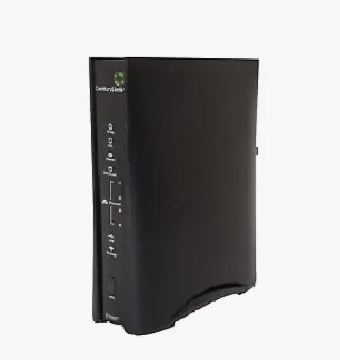</div>
<br>
<hr style="height: 4px">

## Intro
Welcome to the third and final part of the hacking on a budget series, starring the CenturyLink C1100T router. This one took quite some time to finish because I needed to get some additional hardware to finish the pwn and shipping from China took almost a month per item. Nonetheless, for a whopping $1, this was hands down the most fun I've had with hardware hacking to date. This router really made me put my thinking cap on, threw me down some rabbit holes with the UBI file system, but finally fell due to the good ol' hacker's persistence (aka the try harder method). I hope you find this one as enjoyable as I did!

## OSINT
The minimal OSINT I performed on this device yielded me a vendor supplied firmware file, which was very helpful as you will see later on. The firmware was hosted directly by CenturyLink [here](https://www.centurylink.com/home/help/internet/modems-and-routers/retired-centurylink-modems.html) ([direct download](http://internethelp.centurylink.com/internethelp/modems/c1100t/firmware/CTW004-5.02.18.3.0412.bin)). Fun fact, it was not encrypted.

## Access
After cracking open the case, taking out the main board, and uncovering all metal shielding, I found that the layout was pretty straightforward. The board had an exposed 4-pin connector which immediately screamed UART to me, a pretty sizable heatsink (which got very hot during normal operation, might I add) on top of the main chip, and what I later identified to be the flash chip on the underside of the board.

<div style="text-align:center"></div>
<div style="text-align:center"></div>

### UART
On all the routers I've tested thus far in this series, UART has been very upfront across all of them, including here. I tested it with my multi meter to get the correct pinout, which turned out to be as such:

<div style="text-align:center">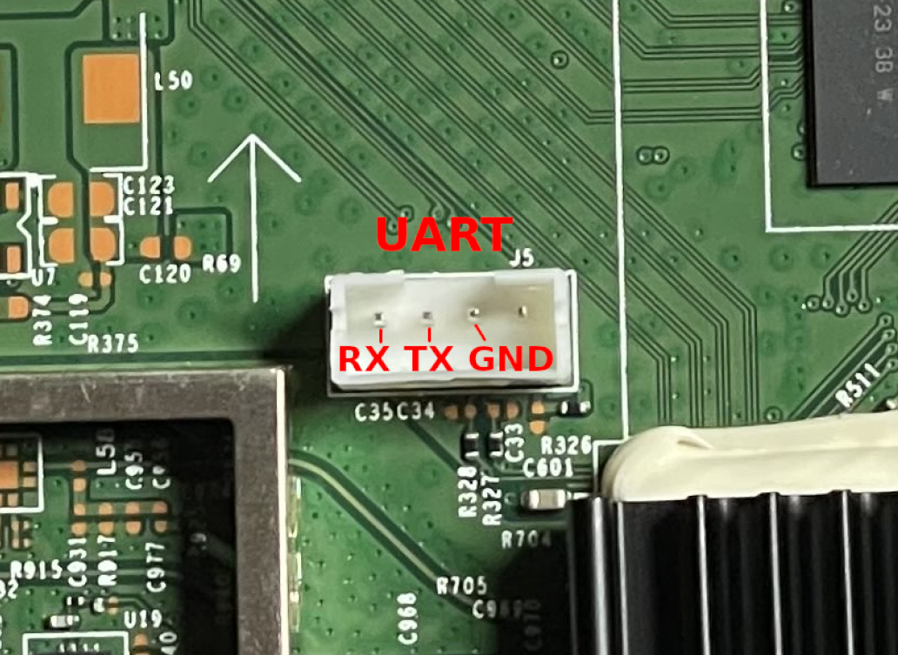</div>

I hooked it up to my Flipper and used `picocom` to connect to it. For the baud rate, my first guess was `115200` which happened to be correct. Below is a short excerpt from the beginning of the router's boot:
```
# picocom /dev/ttyACM0 -b 115200 --log boot.log

<...snip...>

HELO
CPUI
L1CI
HELO
CPUI
L1CI
DRAM
----
PHYS
STRF
400H
PHYE
DDR3
SIZ4
SIZ3
SIZ2
DINT
USYN
LSYN
MFAS
LMBE
RACE
PASS
----
ZBSS
CODE
DATA
L12F
MAIN
FPS0
BT00
0001
BT01
0488
NAN3
RFS2
NAN5


Base: 4.16_03
CFE version 1.0.38-118.3 for BCM963268 (32bit,SP,BE)
Build Date: Wed Jun 14 13:56:05 EDT 2017 (mcclearym@mcclearym-server1)
Copyright (C) 2000-2015 Broadcom Corporation.

Boot Strap Register:  0x1ffb5bf
Chip ID: BCM63168D0, MIPS: 400MHz, DDR: 400MHz, Bus: 200MHz
Main Thread: TP0
Memory Test Passed
Total Memory: 134217728 bytes (128MB)
Boot Address: 0xb8000000

NAND ECC BCH-8, page size 0x800 bytes, spare size used 64 bytes
NAND flash device: Micron MT29F1G08AAC, id 0x2cf1 block 128KB size 131072KB
```

So I was dealing with a CFE boot loader and OpenWrt (as later confirmed when the router returned an OpenWrt login prompt). I quickly tested the default OpenWrt credentials, but they did not work.
```
OpenWrt login: root
Password:
Login incorrect
```

I then looked through the boot output and found some useful and interesting things. During the first phase of boot, a prompt popped up to press any key to stop the auto run process:
```
<...snip...>

External switch id = 53125
*** Press any key to stop auto run (1 seconds) ***
Auto run second count down: 0

<...snip...>
```

I also picked up the memory addresses for the partitions:
```
[    1.509468] Creating 9 MTD partitions on "brcmnand.0":
[    1.514259] 0x0000040c0000-0x0000079e0000 : "rootfs"
[    1.521344] mtd: device 0 (rootfs) set to be root filesystem
[    1.526728] 0x000000020000-0x000003d00000 : "rootfs_update"
[    1.534266] 0x000007a00000-0x000007e00000 : "rootfs_data"
[    1.540494] 0x000000000000-0x000000020000 : "nvram"
[    1.546301] 0x000000020000-0x000003d00000 : "image_update"
[    1.553350] 0x000003d00000-0x0000079e0000 : "image"
[    1.559667] 0x000003d00000-0x0000040c0000 : "bootfs"
[    1.565554] 0x000000000000-0x000008000000 : "dummy2"
[    1.572758] 0x000007e00000-0x00000fc00000 : "persist"
```

Everything else appeared to be standard boot output, which I saved for reference in the future. Anyways, I returned to the login prompt for now where I tested the admin credentials listed on the router's sticker:

<div style="text-align:center"></div>

Sure enough, these worked! I was then greeted by a very scary message from Technicolor:
```
This program contains proprietary information which is a trade secret of Technicolor
and also is protected by intellectual property as an unpublished work
under applicable Copyright laws/right of authorship.
This program is also subject to some patent and pending patent applications.
Technicolor is registered trademark and trade name of Technicolor group company,
and shall not be used in any manner without express written from Technicolor.
The use of the program and documentation is strictly limited to your own internal
evaluation of the product embedding such program, unless expressly agreed otherwise
by Technicolor under a specific agreement.
Recipient is to retain this program in confidence and is not permitted to use
or make copies thereof other than as permitted in a written agreement with Technicolor,
unless otherwise expressly allowed by applicable laws.
Recipient is not allowed to make any copy, decompile, reverse engineer, disassemble,
and attempt to derive the source code of, modify, or
create derivative works of the program, any update, or any part thereof.
Any violation or attempt to do so is a violation of the rights of Technicolor.
If you or any person under your control or authority breach this restriction,
you may be subject to prosecution and damages.
====================================================================================
admin>
```

lol, okk...

The console prompt at first glance did not appear to be your standard `/bin/sh`. And indeed it wasn't. I tried executing `pwd` and was told that the command was invalid. However, I did get back a list of all available commands:
```
admin> pwd
invalid command: [pwd]
AVAILABLE COMMANDS:
===================
  apply
  brctl
  coredump
  count
  dmesg
  dsldiagd
  get  (GetParameterValues,gpv,GPV)
  getpn  (GetParameterNames,gpn,GPN)
  ifconfig
  ifstat
  ifstatus
  ip
  ip6tables
  iptables
  list
  logread
  newsrpuser
  nslookup
  ping
  ps
  readlogfile
  reboot
  resolve
  route
  rtfd
  showinfo
  showtag
  stop
  subscribe
  tcpdump
  top
  traceroute
  ubuscall
  ubuslisten
  unlock
  unsubscribe
  upgrade
  wireless_autochannel
  xdslctl
  reload
  help
  exit
```

I had an idea how to break out of this given my experience with the router from part 2 of this series (modifying firmware). Before doing so, I decided to peep at the firmware I downloaded from the vendor's website to get an idea of what I was dealing with here.

## Analysis of Vendor's Firmware
I kicked off analysis of the firmware by using `binwalk` with the `-e` and `-M` arguments. `-M` told `binwalk` to analyze and extract any subsequently extracted files.

<div style="text-align:center">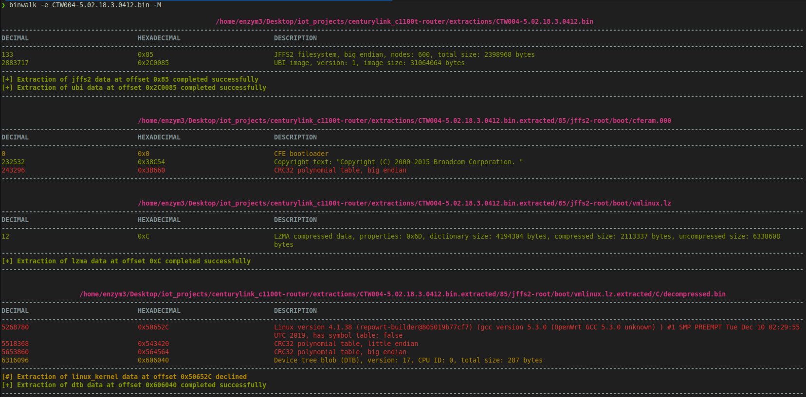</div>

The above screenshot is just an excerpt. The command kept going until it analyzed all the files. Most importantly, I was able to extract the root file system that was contained within the firmware:
```
# cd ./extractions/CTW004-5.02.18.3.0412.bin.extracted/2C0085/ubifs-root/ubi_2C0085.img/img-1736581915_vol-rootfs_ubifs.ubifs.extracted/0/ubifs-root

# ls
bin  custo  dev  etc  lib  mnt  overlay  proc  rom  root  sbin  sys  tmp  usr  var  www
```

From here, I read the contents of the `etc/inittab` to see what was being executed at boot. Lo and behold, that's where the shell jail resided:
```
# cat etc/inittab
::sysinit:/etc/init.d/rcS S boot
::shutdown:/etc/init.d/rcS K shutdown
::askconsole:/bin/restricted_shell
```

The router executed the `/bin/restricted_shell` script on boot. While I could have just modified this line to read `::askconsole:/bin/sh` and then re-flashed the firmware onto the device, I figured I would take a look at the script to see if I can find a bypass first. I looked through the script and could not find a way to manually bypass the shell restrictions. I tried using AI to help me figure out what potential attack vectors would be possible against this script, but came up empty handed. As such, I moved onto analyzing the router's web UI next to see what features may be hiding there.

## Web Portal
Just like with the first router in this series, which was also a CenturyLink device, I went into the Advanced Setup portion of the portal and enabled remote console over SSH while configuring credentials for the `admin` user. I set the password to `Passw0rd!` as the config required some complexity.

<div style="text-align:center">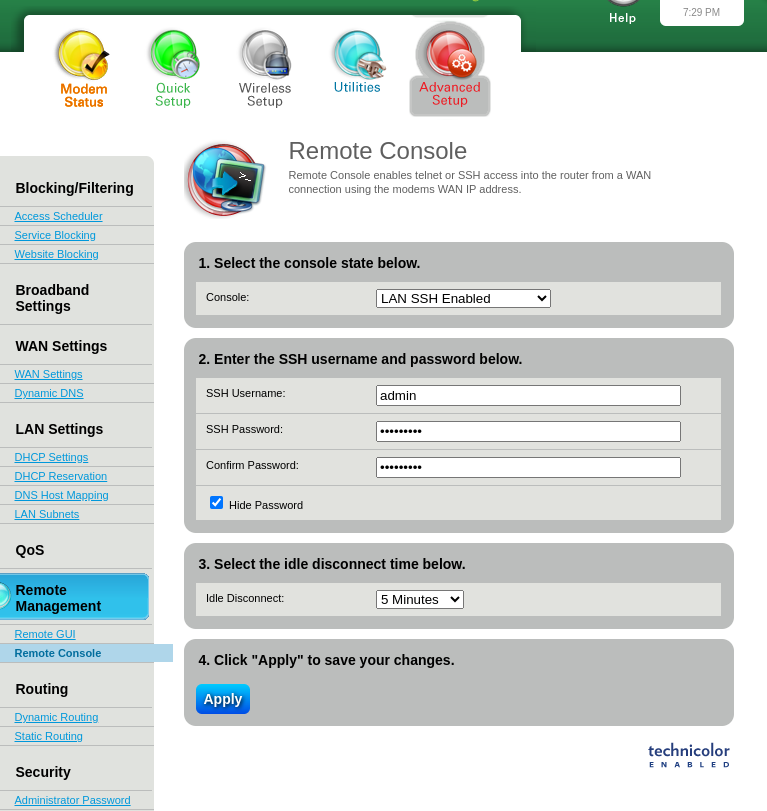</div>

However, connecting to the device through SSH resulted in the same restricted prompt being returned as through the serial console. Since the SSH username field was editable, I change the user to `root` and gave it a new password to see if I could modify the actual root's password this way.

<div style="text-align:center">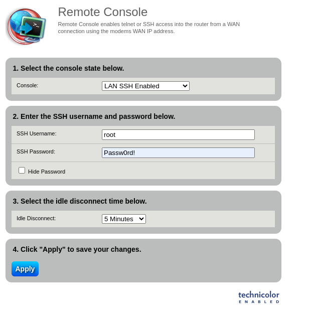</div>

Ultimately, it didn't. The web GUI did offer a way to upgrade firmware on the device, so there was my chance to upload a modified firmware that may override the shell jail applied by the `restricted_shell.sh` script.

## Firmware Modification
To test if modifying the firmware would work, I first printed out the strings of the downloaded firmware file to see if I can find a reference to the `::askconsole/bin/restricted_shell` line, and indeed I did:
```
# xxd CTW004-5.02.18.3.0412.bin | less

<...snip...>

009b99e0: 6974 2e64 2f72 6353 204b 2073 6875 7464  it.d/rcS K shutd
009b99f0: 6f77 6e0a 3a3a 6173 6b63 6f6e 736f 6c65  own.::askconsole
009b9a00: 3a2f 6269 6e2f 7265 7374 7269 6374 6564  :/bin/restricted
009b9a10: 5f73 6865 6c6c 0aff ffff ffff ff31 1810  _shell.......1..
009b9a20: 068e 6107 a941 1900 0000 0000 00a0 0000  ..a..A..........

<...snip...>
```

I copied line `009b9a00` to a hex editor and modified it to read `/bin/sh`. <i>Note: I confirmed `/bin/sh` existed inside the firmware's packaged OS before making this mod.</i>
```
Old values:
009b9a00: 3a2f 6269 6e2f 7265 7374 7269 6374 6564  :/bin/restricted
009b9a10: 5f73 6865 6c6c 0aff ffff ffff ff31 1810  _shell.......1..

New values:
009b9a00: 3A2F 6269 6E2F 7368 ffff ffff ffff ffff  :/bin/sh........
009b9a10: ffff ffff ffff ffff ffff ffff ff31 1810  .............1..
```

I hoped there were no CRC values I had to worry about here, because with this modification, any error checks would fail. Next I went ahead and tried to upgrade the firmware through the portal:

<div style="text-align:center">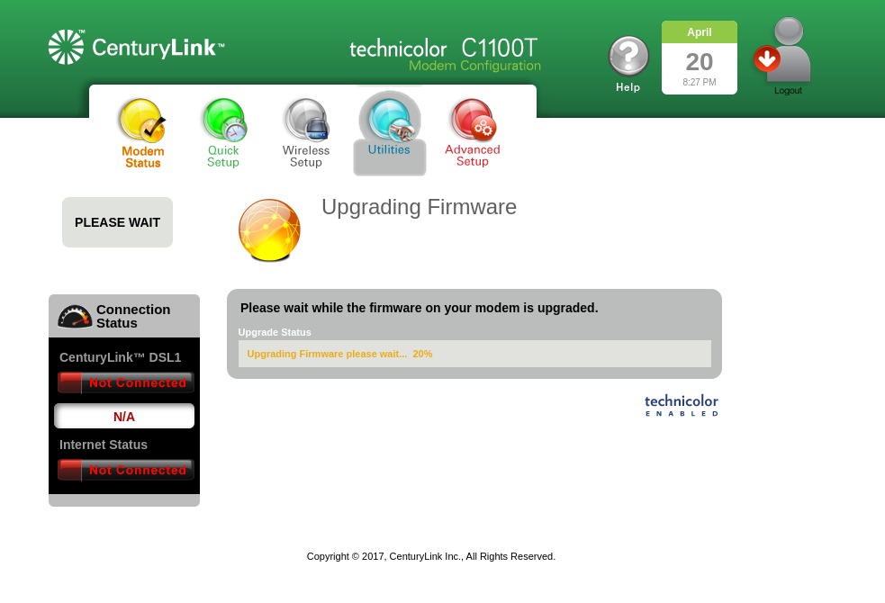</div>

However, I got an error:

<div style="text-align:center">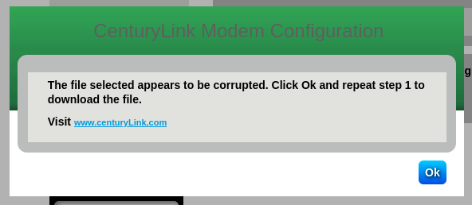</div>

While doing the upgrade, I had my UART connection plugged in so I can monitor for any output. The serial connection unfortunately was not giving me any feedback as to why it failed (although it was pretty clear what the issue was). 

Next, I tried to modify the firmware in a more meticulus way by extracting and rebuilding the UBI image. First, I used `dd` to extract just the UBI image from the firmware file. I also validated the file signatures were correct by comparing the output of `binwalk`. 
```
# binwalk CTW004-5.02.18.3.0412.bin

/home/enzym3/Desktop/iot_projects/centurylink_c1100t-router/CTW004-5.02.18.3.0412.bin
------------------------------------------------------------------------
DECIMAL                            HEXADECIMAL                        DESCRIPTION
------------------------------------------------------------------------
133                                0x85                               JFFS2 filesystem, big endian, nodes: 600, total size: 2398968 bytes
2883717                            0x2C0085                           UBI image, version: 1, image size: 31064064 bytes
------------------------------------------------------------------------

Analyzed 1 file for 85 file signatures (187 magic patterns) in 47.0 milliseconds

# dd if=CTW004-5.02.18.3.0412.bin of=router.img skip=2883717 bs=1 count=31064064

31064064+0 records in
31064064+0 records out
31064064 bytes (31 MB, 30 MiB) copied, 20.984 s, 1.5 MB/s

# binwalk router.img

/home/enzym3/Desktop/iot_projects/centurylink_c1100t-router/router.img
------------------------------------------------------------------------
DECIMAL                            HEXADECIMAL                        DESCRIPTION
------------------------------------------------------------------------
0                                  0x0                                UBI image, version: 1, image size: 31064064 bytes
------------------------------------------------------------------------

Analyzed 1 file for 85 file signatures (187 magic patterns) in 28.0 milliseconds

```

I then printed out the UBIFS info using `ubireader_display_info` command. This extracted for me the CRC of the contained volume.
```
# ubireader_display_info router.img

UBI File
---------------------
	Min I/O: 2048
	LEB Size: 126976
	PEB Size: 131072
	Total Block Count: 237
	Data Block Count: 235
	Layout Block Count: 2
	Internal Volume Block Count: 0
	Unknown Block Count: 0
	First UBI PEB Number: 0

	Image: 1736581915
	---------------------
		Image Sequence Num: 1736581915
		Volume Name:rootfs_ubifs
		PEB Range: 2 - 236

		Volume: rootfs_ubifs
		---------------------
			Vol ID: 0
			Name: rootfs_ubifs
			Block Count: 235

			Volume Record
			---------------------
				alignment: 1
				crc: '0x3d365af6'
				data_pad: 0
				errors: ''
				flags: 0
				name: 'rootfs_ubifs'
				name_len: 12
				padding: '\x00\x00\x00\x00\x00\x00\x00\x00\x00\x00\x00\x00\x00\x00\x00\x00\x00\x00\x00\x00\x00\x00\x00'
				rec_index: 0
				reserved_pebs: 235
				upd_marker: 0
				vol_type: 'static'

```

<i>Do not be fooled by my foo here, I omit quite a bit of this but I spent a significant amount time researching UBIFS to understand which commands to run and what each command did. I just keep it short and simple for brevity and flow reasons. The spinning wheels and research phase occurred pretty much between each console output you see within this post ;)</i>

After making the necessary modifications to the `inittab` file to now reflect `/bin/sh` instead of `/bin/restricted_shell`, I went ahead and rebuilt the UBI image. Below is the output from binwalk showing the newly built UBIFS image:
```
# binwalk rebuilt_router.ubi

                                                          /home/enzym3/Desktop/iot_projects/centurylink_c1100t-router/modded/rebuilt_router.ubi
------------------------------------------------------------------------
DECIMAL                            HEXADECIMAL                        DESCRIPTION
------------------------------------------------------------------------
0                                  0x0                                UBI image, version: 1, image size: 33816576 bytes
------------------------------------------------------------------------

Analyzed 1 file for 85 file signatures (187 magic patterns) in 88.0 milliseconds

```

As you can see, the size of the image is slightly off, but I figured this wouldn't hurt anything since the UBI image resided at the end of the firmware file. I then packaged the new UBI image using `dd` to the original firmware file.
```
# dd if=rebuilt_router.ubi of=CTW004-5.02.18.3.0412-hacked.bin seek=2883717 bs=1 conv=notrunc count=33816576

33816576+0 records in
33816576+0 records out
33816576 bytes (34 MB, 32 MiB) copied, 21.3042 s, 1.6 MB/s

# binwalk CTW004-5.02.18.3.0412-hacked.bin

/home/enzym3/Desktop/iot_projects/centurylink_c1100t-router/CTW004-5.02.18.3.0412-hacked.bin
------------------------------------------------------------------------
DECIMAL                            HEXADECIMAL                        DESCRIPTION
------------------------------------------------------------------------
133                                0x85                               JFFS2 filesystem, big endian, nodes: 600, total size: 2398968 bytes
2883717                            0x2C0085                           UBI image, version: 1, image size: 33816576 bytes
------------------------------------------------------------------------

Analyzed 1 file for 85 file signatures (187 magic patterns) in 75.0 milliseconds
```

With the new firmware file built, I attempted to flash it onto the device via the web UI once again.

<div style="text-align:center">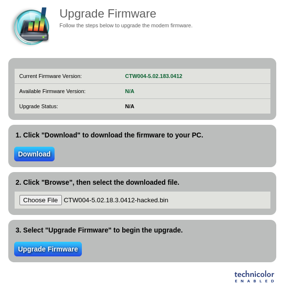</div>

However, this also resulted in the same error message as before. At this point, I spent 2-3 days digging into UBIFS and trying to reconstruct an image that was closer in size to the original. This meant utilizing the same compression methods, testing various UBIFS parameters, and heavily relying on AI to see if it can come up with the correct course of action. Ultimately, these efforts did not yield me a working firmware file that would be accepted by the web UI. I figured there had to be some CRC check occurring on the device that was preventing my firmware from going through. I even passed in the entire, extracted filesystem into Cursor and had the agent walk through the files to identify any logic that may be conducting firmware corruption checks, but that ended up being a lengthy rabbit hole as well. At this point, I left the project alone for a few weeks as I had some life events happening. Upon returning to it and after watching several hardware hacking videos, I decided to proceed with chip-off firmware extraction to see if I can modify the firmware directly on the flash chip itself. This would bypass any protections put in place and potentially get me the root shell I was after.

## Chip-Off Firmware Extraction
Before even attempting the chip-off firmware extraction, I had to up my arsenal as my soldering iron and the CH341a I've relying on thus far would not cut it. I ordered myself an XGecu T48, air re-work station, solder flux in a syringe, and some liquid low melt temp solder. This added another few weeks to the waiting game as I waited for everything to arrive. Once I got it, I realized I now needed a TSOP48 adapter for my XGecu to receive the chip in the first place. The XGecu did not come with one, so I proceeded to order one from Ebay. After waiting for almost a month, it finally arrived from China. At this point, I was ready to go.

Before attempting to take off the flash chip from the board, I sacrificed the Belkin router I pwned in part 2 of this series and used it as my practice board for desoldering components off the board using the re-work station. It was harder than I thought, but once I got the hang of it, I was able to take chips off without bending any of their pins. This gave me enough confidence to go ahead and remove the flash chip from my board. It was going so smoothly, nothing could go wrong right? WRONG. After I threw the flash chip into my TSOP48 reader, my XGecu refused to read it! After an hour or two of playing around with it, I gave up and decided to order the Xgecu suggested TSOP48 adapter. You know what this meant right? Another month of waiting for it to arrive from China...

...but once it arrived, I popped the chip in, and after cleaning the pins, moving the chip back and forth, it finally registered all pins and read the contents of the chip!!!! Success!

<div style="text-align:center"></div>

<div style="text-align:center">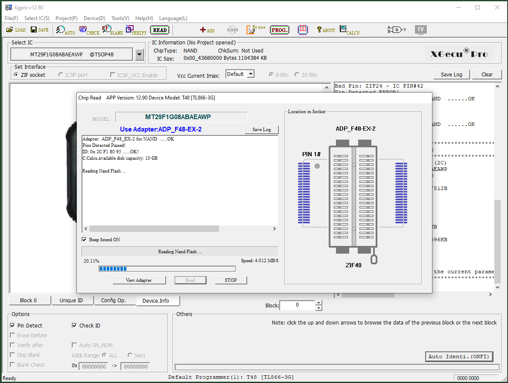</div>

Now with the firmware extracted from the chip, I could now make the necessary modification to hopefully trigger a boot into a non-restricted shell. I used a hex editor to open the firmware dump and searched for the `/bin/restricted_shell` string. After several skips, I landed on the correct entry:

<div style="text-align:center">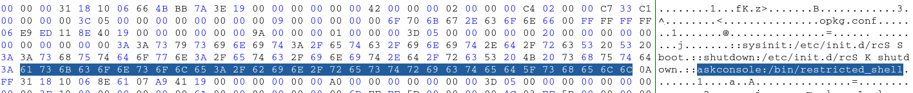</div>

I simply changed the `restricted_shell` bit to `sh`, resulting in `/bin/sh`:

<div style="text-align:center">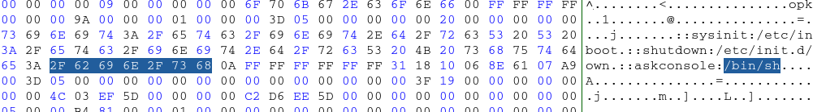</div>

Then, I reattached the chip to my reader and flashed it with the modified firmware. It all went smooooooothly this time.

<div style="text-align:center">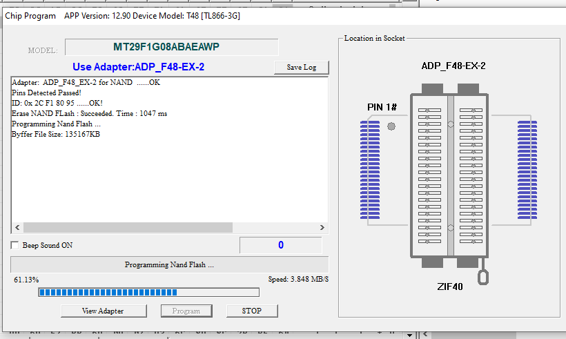</div>

Now I was left with the scary part, soldering the chip back on. I did one round of chip soldering practice using the low melting temp solder paste on my (now) practice Belkin board, and it went good 'nuff (I think, did not actually test the board but solder joints were acceptable). So with one practice round done, I went onto soldering the actual chip back on. First, I cleaned up the pads with some soldering wick and flux.

<div style="text-align:center">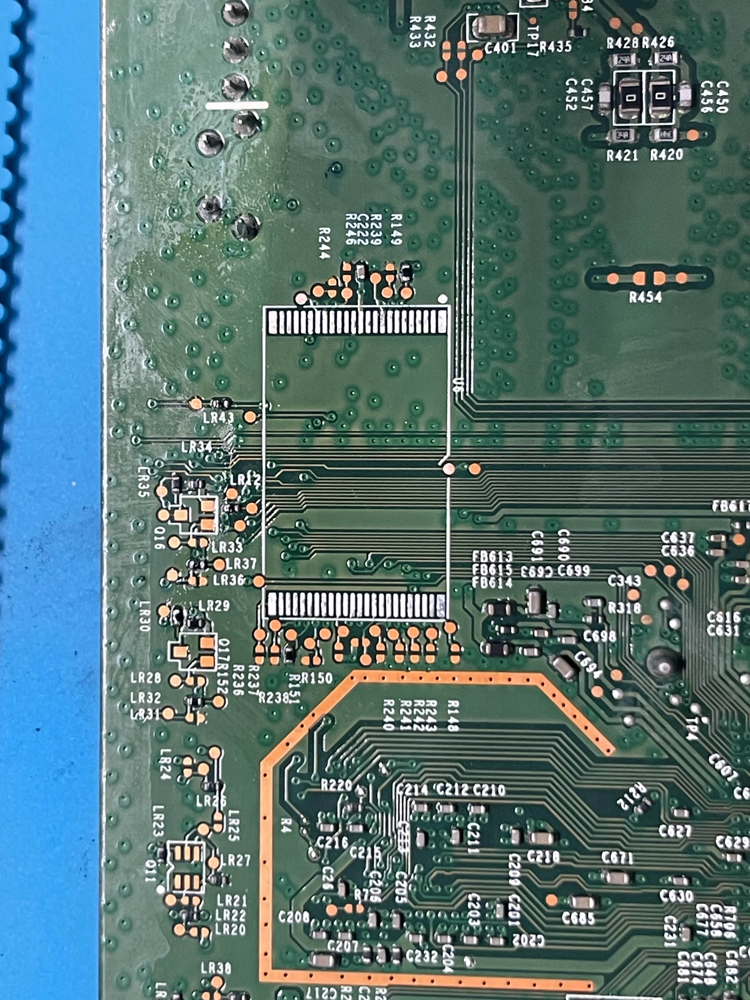</div>

Then, I went ahead and spread a thin bead of solder paste across the pads and melted it on with my re-work station. I cleaned up the pads with a wick while keeping heat on the pads to ensure the pads did not have any blobs that connected them together. The prepped pads looked good under the microscope.

<div style="text-align:center">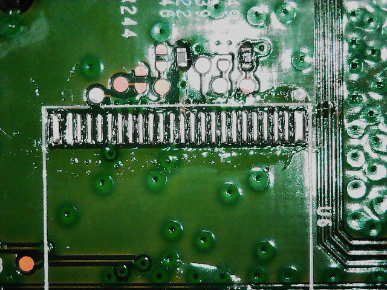</div>

I cleaned it all up with some iso alcohol and placed the chip in its original orientation back onto the pads, making sure the chip legs were aligned with the pads. I added a bit of flux just for good measure. While holding the chip down with my tweezers, I applied heat with the rework station to both sides of the chip, in a circular motion. The solder quickly took to the chip, requiring minimal adjustment with my tweezers as it slightly floated around. Once I thought I had a good alignment, I took the heat off, waited a few seconds, and let the solder solidify. The result was acceptable (I think), with one side being slightly offset, as you can see below.

<div style="text-align:center">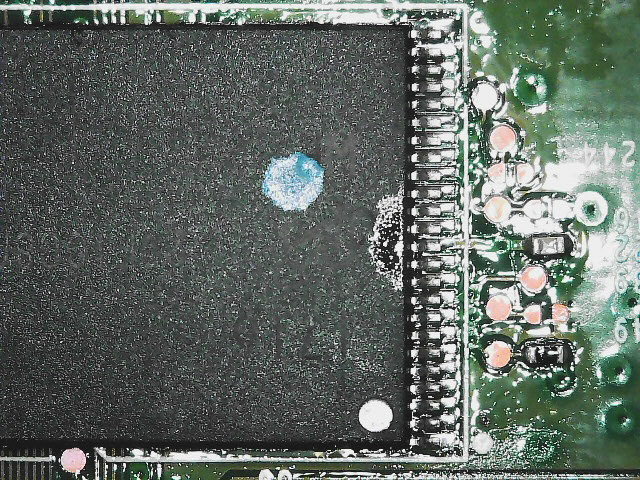</div>

<div style="text-align:center">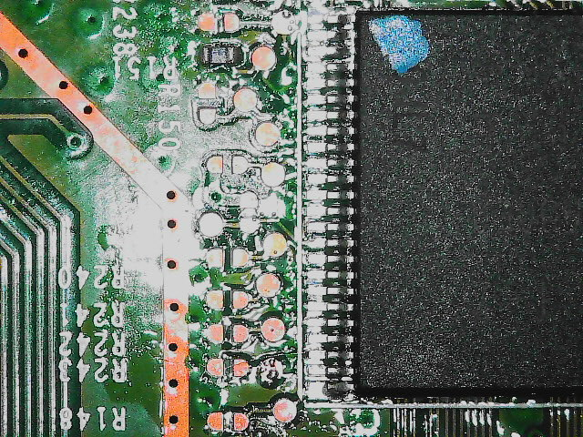</div>

I cleaned it up with some alcohol once more, just for good measure. Now, for the moment of truth, it was time to connect back to UART and see if the firmware successfully loaded! But... it didn't. After hooking up to UART, I got several `bad block` errors during boot; however, that was after loading the image. So perhaps the solder job was solid but the firmware mod was the fail.
```
<...snip...>

Auto run second count down: 0
Correctable ECC Error detected: addr=0x00258600, intrCtrl=0x00000090, accessCtrl=0xE3881010
Correctable ECC Error detected: addr=0x009eaa00, intrCtrl=0x00000090, accessCtrl=0xE3881010
failed to find version file on bank 1
BANK 1 has version UNKNOWN
BANK 2 has version CTW004-5.02.183.0412
Booting from only image (address 0xbbd00000, flash offset 0x03d00000) ...
Decompression LZMA Image OK!
Entry at 0x80014f00
Closing network.
Disabling Switch ports.
Flushing Receive Buffers...
0 buffers found
Closing DMA Channels
Starting program at 0x80014f00
[    0.000000] Initializing cgroup subsys cpu

<...snip...>

[    1.296410] brcmnand_reset_corr_threshold: default CORR ERR threshold  1 bits for CS0
[    1.304442] brcmnand_reset_corr_threshold: CORR ERR threshold changed to 6 bits for CS0
[    1.313099] nand_read_bbt: Bad block at 0x047c0000
[    1.317624] nand_read_bbt: Bad block at 0x047e0000
[    1.322538] nand_read_bbt: Bad block at 0x04800000
[    1.327462] nand_read_bbt: Bad block at 0x04820000
[    1.332384] nand_read_bbt: Bad block at 0x04840000
[    1.337329] nand_read_bbt: Bad block at 0x04860000
[    1.342263] nand_read_bbt: Bad block at 0x04880000
[    1.347166] nand_read_bbt: Bad block at 0x048a0000
[    1.352109] nand_read_bbt: Bad block at 0x048c0000
[    1.357054] nand_read_bbt: Bad block at 0x048e0000
[    1.361972] nand_read_bbt: Bad block at 0x04900000
[    1.366876] nand_read_bbt: Bad block at 0x04920000
[    1.371819] nand_read_bbt: Bad block at 0x04940000

<...snip...>
```

I figured it was possible that since I changed the size of the image (because `/bin/sh` is shorter than `/bin/restricted_shell`) it threw everything out of wack. So I decided to try the chip-off again, but this time padding the firmware with some null bytes. This time, I replaced the `/bin/restricted_shell` with `/bin/sh` and padded it with 14`FF` bytes after the newline `A0` byte, which resulted in maintaining the same size of the firmware, placing everything afterwards at the correct byte offset.

<div style="text-align:center">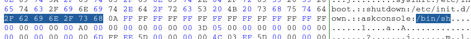</div>

For what it's worth, I think my solder joints came out better on this second try:

<div style="text-align:center">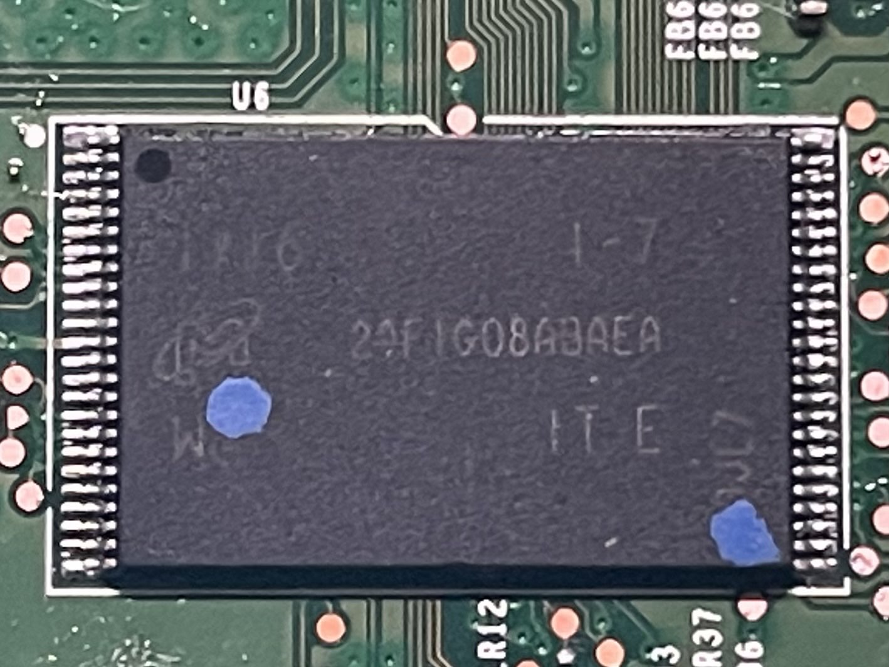</div>

After reconnecting to the UART and booting up the device, a bunch of bad memory errors still flooded my console. HOWEVER! After a few seconds I saw `/ #`. I ran `ls` and `id` and... WE GOT ROOT BABY!
```
[   33.690781] usbcore: registered new interface driver smsc95xx
[   33.699510] usbcore: registered new interface driver cdc_mbim
[   33.705898] kmodloader: done loading kernel modules from /etc/modules.d/*
[   37.272430] jffs2: Empty flash at 0x00062a0c ends at 0x00063000
[   37.311759] jffs2: notice: (754) jffs2_build_xattr_subsystem: complete building xattr subsystem, 0 of xdatum (0 unchecked, 0 orphan) and 0 of xref (0 dead, 0 orphan) found.

/ # 
/ # ls
bin      dev      lib      persist  root     tmp      www
cgroups  etc      mnt      proc     sbin     usr
custo    home     overlay  rom      sys      var
/ # id
uid=0(root) gid=0(root)

<...snip...>
```

I was already giving up hope, this all felt too janky, but persistence paid off! This was a good enough stopping point for me as I was already itching to get to the next device I got sitting in my closet (stay tuned!).

## Closing Thoughts
I must say, getting this root shell brought me back to my early pentesting days and the first time I owned an AD environment. This router definitely helped me up my hardware skills and allowed me to explore avenues I haven't known or tried before. Now with this experience under my belt, I can say I'm definitely more confident in chip-off firmware modification. Honestly, can't wait to do some more in the future.

This router concludes my hacking on a budget series. This was a lot of fun, especially since all the routers cost me less than $8 in total. For anybody thinking of getting into hardware hacking, I highly recommend going this route as well. The amount of learning that can be squeezed out of cheap hardware is mind blowing. Keep an eye out for your local, non-chain, thrift store to find similar deals. Speaking from experience, the chain donation stores like Goodwill tend to overprice their hardware. The lesser known, tucked-in-the-corner-of-the-strip-mall thrift stores tend to be better on prices and are usually less picked through, so I recommend trying there first.

If you made it this far, thank you for coming along on this learning journey with me. Hope you enjoyed it and perhaps it was just what you needed to get your hardware hacking journey started, like myself. If you have any tips, suggestions, or comments, find me on the interwebs. Would love to hear from you!

See you on the next one, and maybe see you at Defcon 2025!