+++
title = 'IoT: Motorola Modem Hattrick (part 1)'
date = 2025-10-01T21:22:05-04:00
draft = false
+++

<h1 style="text-align:center">IoT Series: Motorola Modems - Part 1</h1>
<h2 style="text-align:center">The Motorola Hat-trick</h2>
<br>
<div style="text-align:center">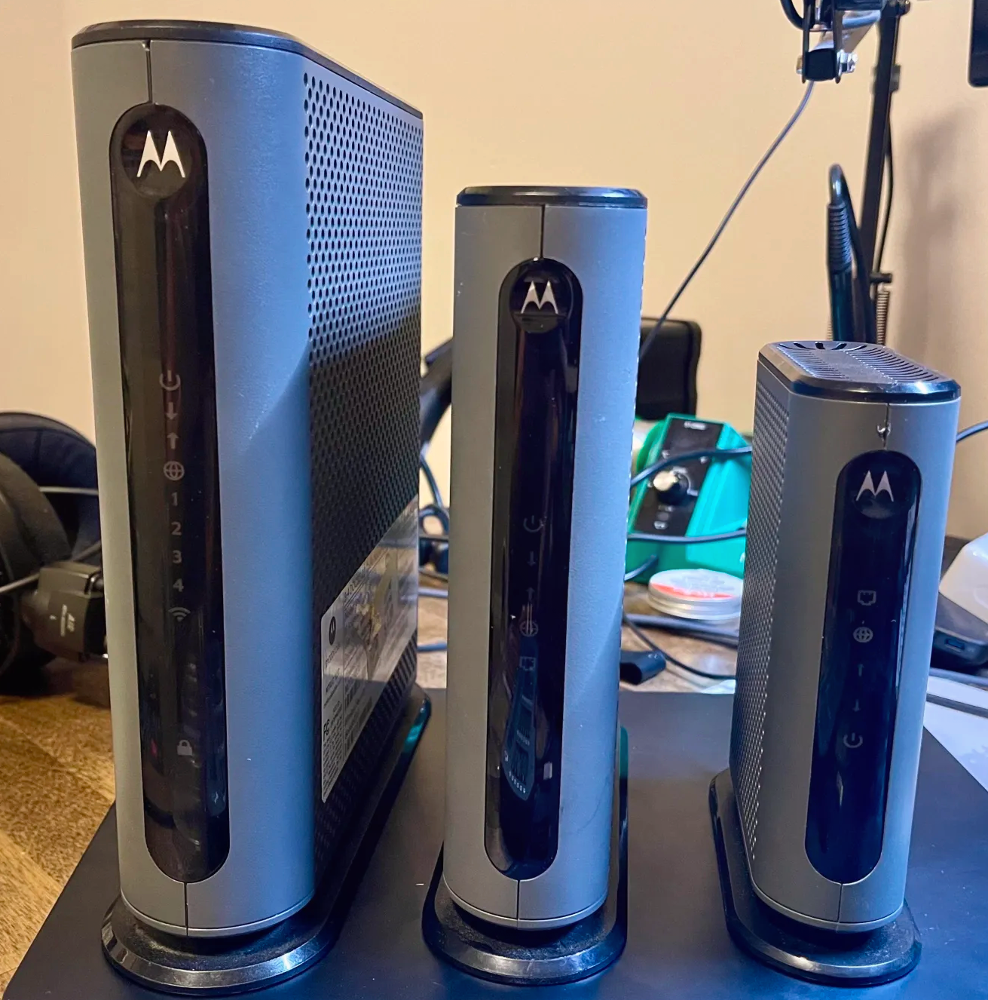</div>
<br>
<hr style="height: 4px">

## Intro
It took me some time to push this one out. It was a big learning curve and a harsh introduction to real-time operating systems (RTOS). This article does not end in a "root shell", but I felt it had enough good information for it to stand on its own as part 1 of this endevour. Plus, I am somewhat hopeful that somebody who's dealt with these devices before, may stumble upon this article and lend a helping hand.

In any case, this project started with me buying a Motorola MG7315 modem from Goodwill for $4.99, only to realize that I had two similar modems stashed away in my networking closet, a Motorola MB7220 and MB8611, both of which shared similar components and appearance making them the perfect subsequent targets. In the title image, the MG7315 is the tallest one, followed by MB8611, and the smallest being MB7220. I also confirmed that the method for compromising MG7315 was nearly identical and worked the same for the MB7220; however, the result was the same lack of root shell. But enough with the spoilers, let's jump right in. 

## OSINT
For OSINT, I referred to the FCC filing photos at one point as I was analyzing the board for potential entry points. The filing photo had the shields removed, which showed off a hidden UART port, so that was useful until I removed the shield myself.
<div style="text-align:center">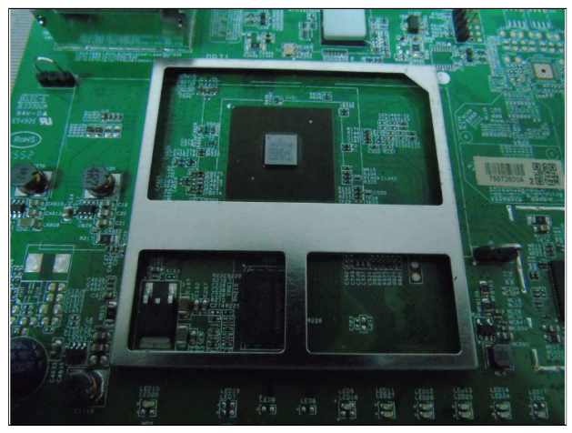</div>

## Internals
The board was pretty clean and easy to work on, just like all the other routers I've messed with in the past. I ended up removing the heat sinks and shields to get a better view of all the components. Afterwards, I started looking for potential access ports.

### Access Ports
After some probing around and taking pictures, I found the following to be the best chance at interacting with the modem.

<div style="text-align:center">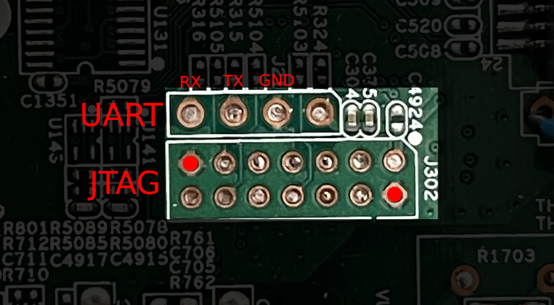</div>

#### JTAG
I recently acquired a Jtagulator at DEFCON 33 (which was a ton of fun might I add) so JTAG was definitely something I was looking to mess around with more. While I did practice a tiny bit using a Raspi 3 and its JTAG through GPIO configuration, I wanted to catch a JTAG in the wild.

Before I could do anything with this port, I had to get a reliable connection to these 14 pins. While I have a pizzabite setup, running 14 probes and keeping them all in contact would have been a nightmare. So I decided to go the easy way by soldering on headers. However, if you notice from the picture, the headers are a bit closer than the UART ones. The UART port uses 2.54mm spacing, while the suspected JTAG holes were spaced out 2mm apart. Luckily, I was able to get <a src=https://www.amazon.com/dp/B0CTKD9FHF>2mm header pins</a> shipped from the Jungle overnight!

Having soldered the headers onto the board, I now had a new problem to solve: DuPont connectors (in their plastic, square cover) were too wide. Solution: make 14 F-to-F DuPont cables that are heatshrink insulated. Aaaand one (maybe two) hours later, voila:

<div style="text-align:center">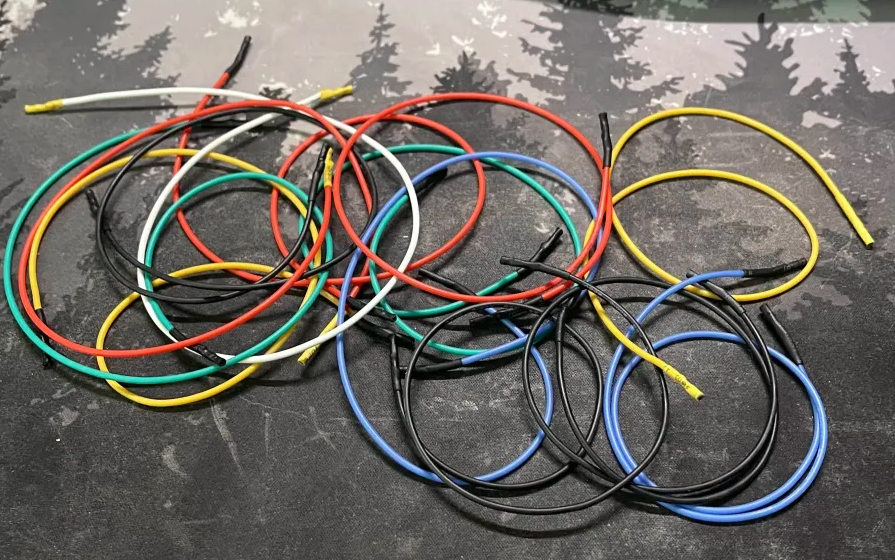</div>

They worked perfectly! I tested each one to make sure it still read the same voltage as it did before (wherever applicable). It was 3.3v in this case.

<div style="text-align:center"></div>

After hooking everything up together, along with my Jtagulator, I attempted to discover JTAG pins using the device ID and boundary scans, unfortunately to no avail. I played around with this setup for close to 5 hours but came out empty handed. Perhaps the JTAG interface was disabled in some way, or this was not JTAG afterall. Nonetheless, it was time to move away to the next item on the list as there was a lot more to discover.

#### Primary UART
The UART pictured above worked as expected. I connected it up to my UART to serial cable and dumped the entire boot log for analysis.

During my previous endeavors, I somewhat neglected the wealth of information provided by the boot log, so this time I decided to really dig into it to gain a better understanding of what's going on. (I also started reading the Mastering Embedded Linux Programming which helped me to get more familiar with the bootloader and its output).

The first portion simply identified the Broadcom chip `BCM3383G-B0` running on the board, along with the SPI chip ID, its size, and some other parameters:

```
BCM338332 Minimum AVS ADC = 869 (960 mv)
Closure_VAVS = 877
AVSThresholds low: ro_h = 819, ro_s = 1012
AVSThresholds high: ro_h = 835, ro_s = 1029

Sync: 0 
MemSize:            128 M
Chip ID:     BCM3383G-B0

BootLoader Version: 2.4.0mp1 huyibao spiboot reduced DDR drive avs
Build Date: Jan 22 2016
Build Time: 11:32:57
SPI flash ID 0xef4018, size 16MB, block size 64KB, write buffer 256, flags 0x0
Cust key size 128

Signature/PID: 7315
```

Following this section was the breakdown of the system image, including:
- File name - `ecram_sto.bin`
- Size - `5140033 bytes`
- Load address - `80004000`
- Offset at which the image was found within the flash - `0x20000`


```
Image 1 Program Header:
   Signature: 7315
     Control: 0005
   Major Rev: 0003
   Minor Rev: 0000
  Build Time: 2020/10/29 17:49:35 Z
 File Length: 5140033 bytes
Load Address: 80004000
    Filename: ecram_sto.bin
         HCS: 2f06
         CRC: 02116e82

Found image 1 at offset 20000

Enter '1', '2', or 'p' within 2 seconds or take default...
```

After allowing the prompt timer to roll through, the device booted from image 1 and returned an eCOS OS banner. I have not previously dealt with eCOS, most of the things I've had a chance to hack operated on U-Boot, so this was a new challenge for me. Quick AI overview of eCOS incoming:

*eCOS (Embedded Configurable Operating System) is an open-source real-time OS for embedded systems that’s lightweight and modular. You can strip it down to just a scheduler or add features like networking, filesystems, and POSIX support. It runs on ARM, MIPS, PowerPC, x86, and more, making it a flexible “build-your-own” OS for everything from tiny MCUs to bigger boards.*

Great, now let's continue with the boot log. The next interesting part included the flash identification and driver loading. The flash chip was identified with an ID of `0xef4018` which corresponded to Winbond W25Q128.

```
[tStartup] BcmBfcStdEmbeddedTarget::InitStorageDrivers:  (BFC Target) Configuring/Loading Flash driver...
[tStartup] BcmSpiFlashDevice::DetectFlash:  (SPI Flash Device Factory) WARNING - Detected SPI flash with JEDEC ID =0xef4018
```

It then attempted to read memory from another flash device, but it was missing. This was a good sign for me as it indicated there isn't another chip on the board that I need to worry about dumping information from (if it comes to that, which it will *spoiler alert*). 

```
[tStartup] FlashDeviceDriver::FlashDriverInit:  (Flash Driver C API) WARNING - Failed to retrieve the memory window associated with flash device 1/CS1!
[tStartup] FlashDeviceDriver::FlashDriverInit:  (Flash Driver C API) WARNING - Failed to detect flash device 1!  Only the first device will be used.
```

Then the log spat out storage driver initialization messages, loading BootloaderStore, ProgramStore, and NonVol drivers.

```
[tStartup] BcmBfcStdEmbeddedTarget::InitStorageDrivers:  (BFC Target) Loading BootloaderStore driver...
[tStartup] BcmBfcStdEmbeddedTarget::InitStorageDrivers:  (BFC Target) Loading ProgramStore driver...
ProgramStoreDeviceDriver::ProgramStoreDriverInit:  INFO - Initializing...
[tStartup] BcmBfcStdEmbeddedTarget::InitStorageDrivers:  (BFC Target) Loading NonVol driver...
[tStartup] BcmBfcStdEmbeddedTarget::InitStorageDrivers:  (BFC Target) Storage drivers initialized successfully.
```

ChatGPT informed me that ProgramStore is used for firmware and NonVol is for settings. Good to know! Following these messages there was some stack trace output and a few other messages indicating that the device was loading image 1. THEN, the console spat out information that it was reading permanent and dynamic settings from NonVol (which aligns with what ChatGPT told me earlier).

```
Reading Permanent settings from non-vol...
Checksum for permanent settings:  0xca346ee6
Setting downstream calibration signature to '5.7.1mp1|die temperature:69.664degC

Reading Dynamic settings from non-vol...
Checksum for dynamic settings:  0x83daa8b9
Settings were read and verified.

Console input has been disabled in non-vol.
Console output has been disabled in non-vol!  Goodbye...
```

With that, the goal was clear. I needed to get access to the firmware and make necessary changes to non-vol memory to increase verbosity by re-enabling console output, and potentially enabling the eCOS console.

##### Bootloader Console
As a side note, during boot, the bootloader presented a prompt to press `1` to boot image 1, `2` to boot image 2, or `p` to interrupt boot and enter the bootloader console.

```
$ sudo picocom -b 115200 /dev/ttyUSB0

<...snip...>

Enter '1', '2', or 'p' within 2 seconds or take default...
.

Board IP Address  [0.52.20.100]:
Board IP Mask     [255.255.255.0]:
Board IP Gateway  [0.0.0.0]:
Board MAC Address [00:10:18:ff:ff:ff]:

Internal/External phy? (e/i/a)[a] a
Switch detected: 5075
ProbePhy: Found PHY 0, MDIO on MAC 0, data on MAC 0
Using GMAC0, phy 0

Enet link up: 1G full


Main Menu:
==========
  b) Boot from flash
  g) Download and run from RAM
  d) Download and save to flash
  e) Erase flash sector
  m) Set mode
  s) Store bootloader parameters to flash
  i) Re-init ethernet
  r) Read memory
  w) Write memory
  j) Jump to arbitrary address
  X) Erase all of flash except the bootloader
  z) Reset
```

The console itself did not offer any capability to dump flash en masse, whether through TFTP or by printing large parts of memory through serial. As such, manual extraction from the SPI chip was necessary.

#### Secondary UART
Aside from the UART I mentioned above, I found another UART suspect on the board underneath the can (same one that was visible in the FCC filing pictures), but the pins read 0.00v. This could be because they were not bridged. I threw the board under my microscope and started following the traces that led from the UART to the innards of the board. I found they led to this grouping of pads.

<div style="text-align:center">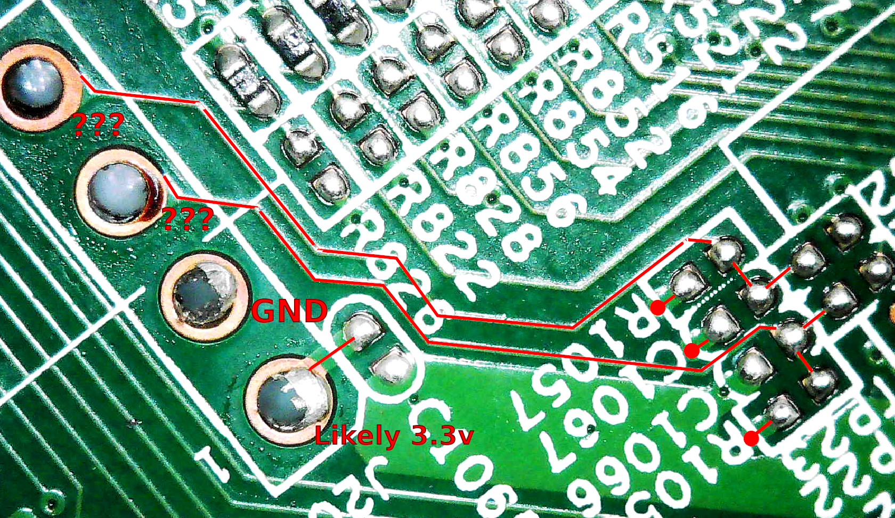</div>
<div style="text-align:center">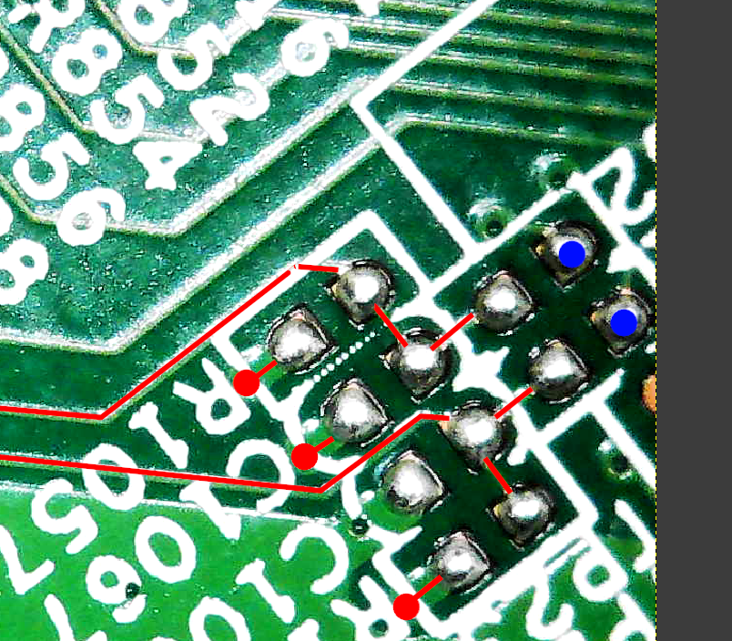</div>

As you can see, I did some analysis and found that the blue-marked blobs emitted a steady 3.3v signal. While my multimeter was seeing a fluctuation from 3.34v to 3.35v, hooking the pads up to my logic analyzer did not reveal any signal changes, except for one burst of ups and downs on two of the pins.

Something was fishy here and I did not like it, so I kept digging. I took pictures of both top and bottom of the board where the suspected UART resided and I overlaid them in GIMP. From there, I could tell where the two pads dropped down to at the bottom of the PCB and connected back to the main SoC from the bottom. This told me that everything *should* be gucci, but it was not (for some reason unknown to me). So, I decided to move on from this effort for now and focus on getting my hands on the firmware.

### Firmware
On the underside of the board resided the most likely candidate for storing the firmware for the device. It was a Winbond 25Q128FVSG flash chip (which matched the chip mentioned earlier in the boot log):

<div style="text-align:center">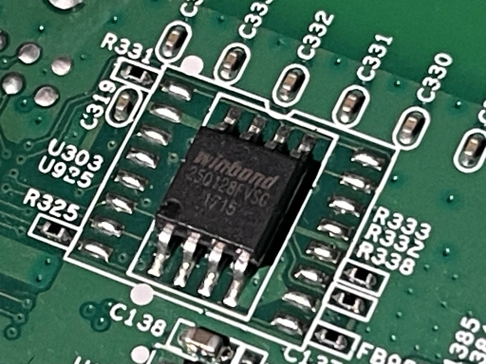</div>

After making solid contact with the SPI chip, the software automatically detected several versions of the chip, from which I simply had to narrow it down to the 25Q128FV SOIC8 version.

<div style="text-align:center">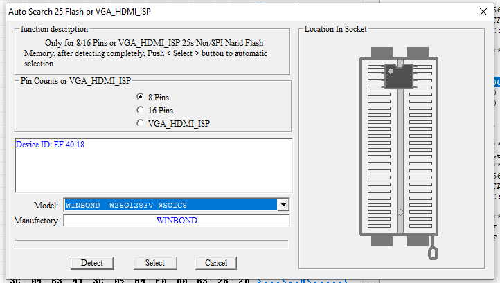</div>

Then, it was just a matter of hitting READ and saving the output.

#### Analysis
Having saved the firmware to a file, I ran it through Binwalk to see what signatures can be identified.

```
$ binwalk W25Q128FV.bin

DECIMAL       HEXADECIMAL     DESCRIPTION
--------------------------------------------------------------------------------
66816         0x10500         Private key in DER format (PKCS header length: 4, sequence length: 631
66842         0x1051A         Private key in DER format (PKCS header length: 4, sequence length: 605
67725         0x1088D         Certificate in DER format (x509 v3), header length: 4, sequence length: 796
68527         0x10BAF         Certificate in DER format (x509 v3), header length: 4, sequence length: 1233
131164        0x2005C         LZMA compressed data, properties: 0x5D, dictionary size: 16777216 bytes, missing uncompressed size
16713058      0xFF0562        Certificate in DER format (x509 v3), header length: 4, sequence length: 1251
16745826      0xFF8562        Certificate in DER format (x509 v3), header length: 4, sequence length: 1251
```

I got some key and certificate signatures along with an LZMA signature. This potentially meant that the firmware was encrypted. Binwalk's entropy graph seemed to confirm this to be the case as there were portions of the firmware with high levels of entropy. However, it's important to note that compression will appear similar on the entropy graph.

<div style="text-align:center">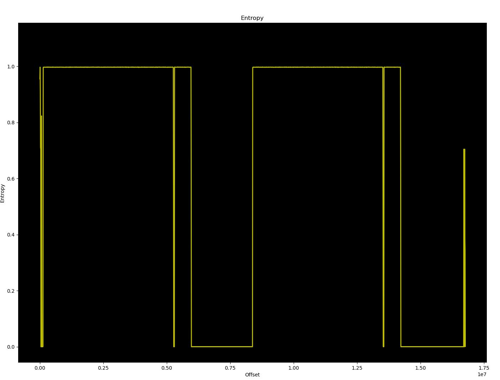</div>

Since only portions of the firmware were identified with high entropy, it meant that there was some data in there that may be unencrypted. This could include decryption logic. I ran `strings` on the file to get a list of any human readable strings present in the file, and got a quite substantial list:
```

# strings W25Q128FV.bin

<...snip...>

DOCSIS1
	D CA000011?0=
6CableLabs, Inc. Cable Modem Root Certificate Authority0
Jx[q
5f7)"
uC7l~&I
Device2048-1-2180
US1907
0Data Over Cable Service Interface Specifications1
Cable Modems1604
-DOCSIS Cable Modem Root Certificate Authority
4G-W
SAm"
CMEV
uNo Ranging Response received - T3 time-out;CM-MAC=00:40:36:4a:90:c0;CMTS-MAC=00:01:5c:69:88:73;CM-QOS=1.0;CM-VER=3.0;
Started Unicast Maintenance Ranging - No Response received - T3 time-out;CM-MAC=00:40:36:4a:90:c0;CMTS-MAC=00:01:5c:69:88:73;CM-QOS=1.1;CM-VER=3.0;
```

Subsequently, I tried extracting the file with both legacy and v3 versions of Binwalk, to no avail. Legacy Binwalk supposedly extracted the LZMA file, but it was a fluke. As such, I decided to try decompiling the file as Binwalk reported several MIPS signatures within the file.

```
$ binwalk -A W25Q128FV.bin

DECIMAL       HEXADECIMAL     DESCRIPTION
--------------------------------------------------------------------------------
23964         0x5D9C          MIPS instructions, function epilogue
26952         0x6948          MIPS instructions, function epilogue
29268         0x7254          MIPS instructions, function epilogue
29392         0x72D0          MIPS instructions, function epilogue
29472         0x7320          MIPS instructions, function epilogue
29784         0x7458          MIPS instructions, function epilogue
29912         0x74D8          MIPS instructions, function epilogue
30072         0x7578          MIPS instructions, function epilogue
30168         0x75D8          MIPS instructions, function epilogue
30600         0x7788          MIPS instructions, function epilogue
30692         0x77E4          MIPS instructions, function epilogue
30840         0x7878          MIPS instructions, function epilogue
31040         0x7940          MIPS instructions, function epilogue
31152         0x79B0          MIPS instructions, function epilogue
32192         0x7DC0          MIPS instructions, function epilogue
32384         0x7E80          MIPS instructions, function epilogue
33392         0x8270          MIPS instructions, function epilogue
34216         0x85A8          MIPS instructions, function epilogue
34260         0x85D4          MIPS instructions, function epilogue
34360         0x8638          MIPS instructions, function epilogue

<...snip...>
```

I looked through some of the decompiled functions but it was all hurting my eyes. Ultimately, after digging through the functions both manually and with the assistance of AI, I did not find any blatant functions that handled decryption of the firmware.

#### Deciphering the Firmware
I spun my wheels for quite some time with the firmware and started to lose hope. However, that's when I stumbled upon a very interesting Git repo: <a src=https://github.com/jclehner/bcm2-utils>bcm2-utils</a>. The repo housed utilities for broadcom-based cable modems. BINGO! But there was a catch, the utility to dump flash required a serial connection (one that had access to the eCOS console) or Telnet. I confirmed Telnet was not made available by the modem after I hooked up my laptop to it via Ethernet. All that was exposed was the modem's configuration page hosted via HTTP.

However, that's not all. The repo's README was a goldmine of information about these modems. The most notable line read:

```
Firmware images are usually in Broadcom's ProgramStore format. Utilities for extraction and compression are available from Broadcom (and GPLv3'd!):

https://github.com/Broadcom/aeolus/tree/master/ProgramStore
```

Well that sounded familiar.  During boot, the boot log mentioned loading a ProgramStore driver. So that's where I decided to go next. I downloaded the ProgramStore program, compiled it, and here's what I had:

```
$ ./ProgramStore
usage: ./ProgramStore -f infile1 [-f2 infile2] [-o outfilename] [-v xxx.xxx] [-c x] [-x] [-s sig] [-t time] [-a addr]
       -f    -- specify the input filename    (required)
       -f2   -- specify second input filename (for dual image)
       -o    -- specify the output filename   (default input filename changed to .out)
       -v    -- specify the version           (default 000.000)
       -c 1  -- use old compression           (default)
       -c 2  -- use miniLZO compression
       -c 3  -- use NRV2D99 compression       (slowest and best)
       -c 3x -- (x=1-9) NRV2D99 compression   (faster, but less compression)
       -c 4  -- use LZMA compression
       -s    -- specify the signature         (default 0x3350)
       -t    -- specify the build time as integer time since epoch (default is current time)
       -a    -- specify the Load Address      (default 0x00000000)
       -r    -- print revision information
       -p    -- pad image 1 to n bytes to align image 2 (-f2)
       -x    -- decompress the input file
```

Luckily for me, the bcm2-utils repo had an extensive <a src=https://github.com/jclehner/bcm2-utils/blob/master/doc/programstore.md>readme</a> about ProgramStore. It essentially explained what I already learned earlier about eCOS:

<div style="text-align:center">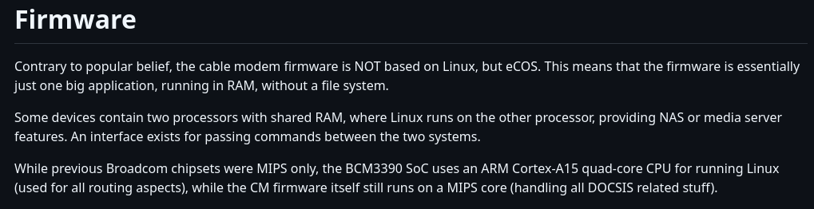</div>

Then it goes on to provide the magic files for Binwalk, along with an explanation of the firmware format. As suspected, the firmware was in the ProgramStore format, which uses a 92-byte header. Before going the manual route, I copied the Binwalk magic files to `~/.config/binwalk/magic/` and re-ran Binwalk against the firmware file.

```
$ binwalk W25Q128FV.bin

DECIMAL       HEXADECIMAL     DESCRIPTION
--------------------------------------------------------------------------------
1808          0x710           BCM33xx ProgramStore image, signature: 0x3383, dual: no, compression: LZMA, version: 0.0, build time: 2016-01-22 03:32:57, size: 18943 b, load address: 0x83f80000, filename: ram.sto, HCS: 0xda0d, CRC: 0xf43babae
66816         0x10500         Private key in DER format (PKCS header length: 4, sequence length: 631
66842         0x1051A         Private key in DER format (PKCS header length: 4, sequence length: 605
67725         0x1088D         Certificate in DER format (x509 v3), header length: 4, sequence length: 796
68527         0x10BAF         Certificate in DER format (x509 v3), header length: 4, sequence length: 1233
131072        0x20000         BCM33xx ProgramStore image, signature: 0x7315, dual: no, compression: LZMA, version: 3.0, build time: 2020-10-29 17:49:35, size: 5140125 b, load address: 0x80004000, filename: ecram_sto.bin, HCS: 0x2f06, CRC: 0x02116e82
131164        0x2005C         LZMA compressed data, properties: 0x5D, dictionary size: 16777216 bytes, missing uncompressed size
8388608       0x800000        BCM33xx ProgramStore image, signature: 0x0000, dual: no, compression: LZMA, version: 3.0, build time: 2020-10-29 17:49:35, size: 5140125 b, load address: 0x80004000, filename: ecram_sto.bin, HCS: 0x2f06, CRC: 0x02116e82
16713058      0xFF0562        Certificate in DER format (x509 v3), header length: 4, sequence length: 1251
16745826      0xFF8562        Certificate in DER format (x509 v3), header length: 4, sequence length: 1251
```

Well well well, there it is! Binwalk spotted three instances of the ProgramStore image at offsets 0x710, 0x20000 (remember that from the boot log?), and 0x800000. Also notice the file names, the first one was `ram.sto`, whereas the other two were `ecram_sto.bin`.  First, I decided to focus on the signature found at 0x20000 since this was the offset mentioned in the bootlog.

```
131072        0x20000         BCM33xx ProgramStore image, signature: 0x7315, dual: no, compression: LZMA, version: 3.0, build time: 2020-10-29 17:49:35, size: 5140125 b, load address: 0x80004000, filename: ecram_sto.bin, HCS: 0x2f06, CRC: 0x02116e82
```

The detection had several pieces of information that I could correlate with what the board told me during boot. Here is the boot log excerpt which matches up with everything contained within the Binwalk detection:

<div style="text-align:center">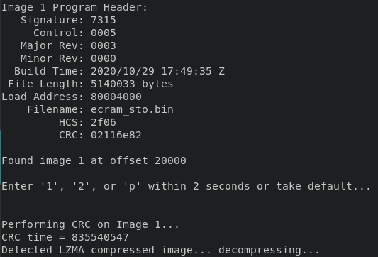</div>

One thing that was different was the size. Boot log stated the image was `5140033 bytes` but Binwalk stated a size of `5140125`. BUT, if you recall, the repo mentioned a 92-byte header. If you add that to the boot log-reported size of 5140033, you get 5140125. So everything checks out! In fact, I also confirmed this using a hex editor. At offset 0x20000 a stream of data begins with a byte sequence of `73 15 00 05...`:

```
$ xxd -s 0x1ffe0 W25Q128FV.bin | head -n 10
0001ffe0: ffff ffff ffff ffff ffff ffff ffff ffff  ................
0001fff0: ffff ffff ffff ffff 0000 2aaa ffff fffe  ..........*.....
00020000: 7315 0005 0003 0000 5f9b 00af 004e 6e41  s......._....NnA
00020010: 8000 4000 6563 7261 6d5f 7374 6f2e 6269  ..@.ecram_sto.bi
00020020: 6e00 0000 0000 0000 0000 0000 0000 0000  n...............
00020030: 0000 0000 0000 0000 0000 0000 0000 0000  ................
00020040: 0000 0000 0000 0000 0000 0000 0000 0000  ................
```

*Notice the file name in the ASCII output as well.* Based on what we know, the end of the image should land around `0x506e9d`. That would be the starting address plus the length of the image, or `0x20000 + 0x4e6e9d` (`0x4e6e9d` is `5140125` in hex):

```
$ python
>>> hex(5140125)
'0x4e6e9d'
>>> hex(0x20000 + 0x4e6e9d)
'0x506e9d'
```

Printing data from `0x506e7d` confirmed the math was mathing as the data ended right where I expected it to:

```
$ xxd -s 0x506e7d W25Q128FV.bin | head -n 10
00506e7d: 8462 a0d8 4168 8a95 c4e0 6263 68b2 2c1a  .b..Ah....bch.,.
00506e8d: 8b54 3954 4509 8559 c83b eb04 dec3 7b10  .T9TE..Y.;....{.
00506e9d: ffff ffff ffff ffff ffff ffff ffff ffff  ................
00506ead: ffff ffff ffff ffff ffff ffff ffff ffff  ................
00506ebd: ffff ffff ffff ffff ffff ffff ffff ffff  ................
00506ecd: ffff ffff ffff ffff ffff ffff ffff ffff  ................
00506edd: ffff ffff ffff ffff ffff ffff ffff ffff  ................
```

Perfect! Now, I figured I would give Binwalk a try to see if it can extract the ProgramStore image automagically with `-e` but it did not. Time for `dd`:

```
$ dd if=W25Q128FV.bin of=ecram_sto.bin skip=131072 count=5140125 iflag=skip_bytes,count_bytes
10039+1 records in
10039+1 records out
5140125 bytes (5.1 MB, 4.9 MiB) copied, 0.0259388 s, 198 MB/s
```

I added the `iflag=skip_bytes,count_bytes` argument to indicate to `dd` that I want the values passed in for `skip=` and `count=` to be treated as bytes. Also, the value of `131072` that I used for `skip=` was simply `0x20000` in decimal. Before proceeding further, I validated the extracted data to ensure it begins and ends with the same hex values:

```
$ xxd ecram_sto.bin | head -n 5
00000000: 7315 0005 0003 0000 5f9b 00af 004e 6e41  s......._....NnA
00000010: 8000 4000 6563 7261 6d5f 7374 6f2e 6269  ..@.ecram_sto.bi
00000020: 6e00 0000 0000 0000 0000 0000 0000 0000  n...............
00000030: 0000 0000 0000 0000 0000 0000 0000 0000  ................
00000040: 0000 0000 0000 0000 0000 0000 0000 0000  ................

$ xxd ecram_sto.bin | tail -n 5
004e6e50: 2602 db10 6f92 4d13 dcf8 e770 e592 50bd  &...o.M....p..P.
004e6e60: b6f7 1d84 5406 a934 c32d c435 b9b7 ae33  ....T..4.-.5...3
004e6e70: 7bbf caa3 a145 643c e346 5ff1 6a84 62a0  {....Ed<.F_.j.b.
004e6e80: d841 688a 95c4 e062 6368 b22c 1a8b 5439  .Ah....bch.,..T9
004e6e90: 5445 0985 59c8 3beb 04de c37b 10         TE..Y.;....{.
```

It looked good to me! I even ran it through Binwalk one more time and it found the expected signature:

```
$ binwalk ecram_sto.bin

DECIMAL       HEXADECIMAL     DESCRIPTION
--------------------------------------------------------------------------------
0             0x0             BCM33xx ProgramStore image, signature: 0x7315, dual: no, compression: LZMA, version: 3.0, build time: 2020-10-29 17:49:35, size: 5140125 b, load address: 0x80004000, filename: ecram_sto.bin, HCS: 0x2f06, CRC: 0x02116e82
92            0x5C            LZMA compressed data, properties: 0x5D, dictionary size: 16777216 bytes, missing uncompressed size
```

*The LZMA signature that Binwalk detects occurs right after the 92-byte header (notice the 92 under the DECIMAL column), which was expected as our image employs LZMA.*

Next, I tried out the ProgramStore utility I compiled earlier. The utility contained a `-x` argument for decompressing the input file. Running it on the extracted image produced a very familiar output.

```
$ aeolus/ProgramStore/ProgramStore -f ecram_sto.bin -x
No output file name specified.  Using ecram_sto.out.
   Signature: 7315
     Control: 0005
   Major Rev: 0003
   Minor Rev: 0000
  Build Time: 2020/10/29 17:49:35 Z
 File Length: 5140033 bytes
Load Address: 80004000
    Filename: ecram_sto.bin
         HCS: 2f06
         CRC: 02116e82

Performing CRC on Image...
Detected LZMA compressed image... decompressing...

Decompressed length unknown.  Padded to 30840750 bytes.
```

Voila! We got ourselves a decompressed eCOS image! Running Binwalk on it spat out a hefty list of signatures, so I went ahead and extracted whatever I could with `-e` for further review.

```
$ binwalk -eM ecram_sto.out

Scan Time:     2025-08-27 14:31:50
Target File:   /home/enzym3/Desktop/projects/iot/motorola_mg7315/ecram_sto.out
MD5 Checksum:  d79cd229e840b4bf6e19723214642555
Signatures:    416

DECIMAL       HEXADECIMAL     DESCRIPTION
--------------------------------------------------------------------------------
496           0x1F0           eCOS kernel exception handler, architecture: MIPS, exception vector table base address: 0x80000300
8068445       0x7B1D5D        bix header, header size: 64 bytes, header CRC: 0x431025AE, created: 1988-01-29 04:05:34, image size: 50335744 bytes, Data Address: 0x31A0030, Entry Point: 0x63FF008E, data CRC: 0x24000C3C, OS: NetBSD, image name: "B"
10666140      0xA2C09C        Certificate in DER format (x509 v3), header length: 4, sequence length: 255
14342990      0xDADB4E        Copyright string: "Copyright (c) 2003-2020 Broadcom Corporation"
14347315      0xDAEC33        Copyright string: "Copyright (c) 1999 - 2020 Broadcom Corporation"
14402801      0xDBC4F1        Unix path: /home/broadcom/cu.cfg
14460544      0xDCA680        Neighborly text, "Neighbor Discovery Snoop for CM stack"
14460811      0xDCA78B        Copyright string: "Copyright (c) 1999 - 2020 Broadcom Corporation"
14531480      0xDDBB98        Neighborly text, "NeighborDiscoveryEventecting it!  Ignoring..."
14643553      0xDF7161        Unix path: /home/broadcom/cu.cfg
14705760      0xE06460        Neighborly text, "NeighborSolicitation :sing link local frame to IP stack:"
14705792      0xE06480        Neighborly text, "NeighborAdvertisement :k:"
14793897      0xE1BCA9        eCOS RTOS string reference: "eCOSSettings"
14794053      0xE1BD45        eCOS RTOS string reference: "eCOSSettings"
14840184      0xE27178        Base64 standard index table

<...snip...>
```

Unfortunately, that did not yield anything either. So only thing to try was to run the decompressed file through `bcm2cfg`, which worked! It successfully identified some settings in the file.

```
$ bcm2cfg info ecram_sto.out
ecram_sto.out
type    : gwsettings
profile : (unknown)
checksum: 40809000000000000000000000000000
size    : 1014260066 (bad)

20626f72  .bor  100.101  grp_bor       27749 b
20636c61  .cla  115.115  grp_cla       25632 b
20756e69  .uni  113.117  grp_uni        8289 b
273e266e  ...n  98.115  grp_273e266e  28005 b
6465723d  der.  34.48   grp_der       28530 b
6f526749  oRgI  80.118  grp_orgi      28532 b
616e4163  anAc  99.101  grp_anac      22380 b
64272025  d...  115.62  grp_64272025  10021 b
3b0a2020  ....  32.32   grp_3b0a2020   8745 b

<...snip...>
```

The `list` command allowed me to view what settings exist within the file.
 
```
$ bcm2cfg list ecram_sto.out
grp_bor.*
grp_cla.*
grp_uni.*
grp_273e266e.*
grp_der.*
grp_orgi.*
grp_anac.*
grp_64272025.*
grp_3b0a2020.*
grp_20202020.*
grp_lass.*
grp_par.*
grp_ling.*
grp_ss.*
grp_2025733e.*
grp_itwl.*
grp_hep.*
grp_ver.*
grp_5co.*

<...snip...>
```

I poked around these but did not find anything that I could modify to change the behavior of the modem's boot. So back to the drawing board... Luckily, I returned to the repo and started reading about the `bcm2cfg` utility a bit more. The repo mentioned that the supported formats for the tool are `GatewaySettings.bin` or NVRAM dumps. There actually was a <a src=https://github.com/jclehner/bcm2-utils/blob/master/doc/gwsettings.md>separate doc</a> in the repo on these formats. So I dove right in.

#### Extracting the Settings
In my case, I was dealing with NVRAM settings. The first important piece of information mentioned in the doc was that the header for my NVRAM implementation, the pre-BCM3390 chipset version, should be prefixed with 202 `0xFF` bytes. Afterwards, I should expect the header which was the same in both pre and post BCM3390 versions. The header was constructed in the following manner:
- Offset 0: size
- Offset 4: checksum
- Offset 8: data

I searched through the entire hex dump of the firmware for something that would resemble this configuration and I found a few candidates. However, one stood out from the others, residing at a nice address of `0x00FF0000`:

<div style="text-align:center">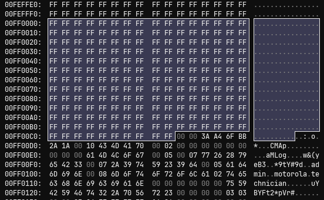</div>

I highlighted the 202 `0xFF` bytes, which were immediately followed by `00 00 3A A4 BB 2A 1A ...`. Based on the documentation, the size of the config should be defined by `00 00 3A A4`, followed by a 4-byte checksum `6F BB 2A 1A`, and then followed by data. This would mean the size of the data should be 15012 bytes (`0x00003AA4` = `15012`). The document also mentioned that the partition's last 8 bytes, from the footer, should specify the following values:
- Offset -8: segment_size
- Offset -4: alignment bytes
- Offset -2: segment bitmask (should be `0xFFFC` if data was never written to it)

Knowing that the device was fresh, post-factory reset, the segment bitmask should still be set to the `0xFFFC`, and when I checked the bottom of the bin dump, there it was!

<div style="text-align:center">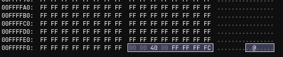</div>

The highlighted portion was, in fact, the three values. Starting from the end of the file, -2 byte offset gave me the expected `0xFFFC` value. Then the additional -2 byte offset specified the `0xFFFF` alignment bytes. Lastly, the `0x00004000` (or 16384) was the size of the segment.

While these values seemed pretty arbitrary to me, they did indicate one thing: the settings were all there. To make use of them, I went ahead and extracted the data from the firmware file with `dd`.

```
$ dd if=W25Q128FV-factory.bin of=nvram.bin skip=16711680 count=65537 iflag=skip_bytes,count_bytes
128+0 records in
128+0 records out
65536 bytes (66 kB, 64 KiB) copied, 0.00150208 s, 43.6 MB/s
```

If you are wondering why I extracted `65537` bytes, it was because that's how many bytes it was from the beginning of the NVRAM header at `0x00FF0000` to the end of the file at `0xFFFFFFFF`.

I validated the header and the end of the extracted `nvram.bin` were correct with `xxd`:

```
$ xxd nvram.bin | head -n 15
00000000: ffff ffff ffff ffff ffff ffff ffff ffff  ................
00000010: ffff ffff ffff ffff ffff ffff ffff ffff  ................
00000020: ffff ffff ffff ffff ffff ffff ffff ffff  ................
00000030: ffff ffff ffff ffff ffff ffff ffff ffff  ................
00000040: ffff ffff ffff ffff ffff ffff ffff ffff  ................
00000050: ffff ffff ffff ffff ffff ffff ffff ffff  ................
00000060: ffff ffff ffff ffff ffff ffff ffff ffff  ................
00000070: ffff ffff ffff ffff ffff ffff ffff ffff  ................
00000080: ffff ffff ffff ffff ffff ffff ffff ffff  ................
00000090: ffff ffff ffff ffff ffff ffff ffff ffff  ................
000000a0: ffff ffff ffff ffff ffff ffff ffff ffff  ................
000000b0: ffff ffff ffff ffff ffff ffff ffff ffff  ................
000000c0: ffff ffff ffff ffff ffff 0000 3aa4 6fbb  ............:.o.
000000d0: 2a1a 0010 434d 4170 0002 0000 0000 0000  *...CMAp........
000000e0: 0000 0061 4d4c 6f67 0005 0007 7726 2879  ...aMLog....w&(y

$ xxd nvram.bin | tail
0000ff60: ffff ffff ffff ffff ffff ffff ffff ffff  ................
0000ff70: ffff ffff ffff ffff ffff ffff ffff ffff  ................
0000ff80: ffff ffff ffff ffff ffff ffff ffff ffff  ................
0000ff90: ffff ffff ffff ffff ffff ffff ffff ffff  ................
0000ffa0: ffff ffff ffff ffff ffff ffff ffff ffff  ................
0000ffb0: ffff ffff ffff ffff ffff ffff ffff ffff  ................
0000ffc0: ffff ffff ffff ffff ffff ffff ffff ffff  ................
0000ffd0: ffff ffff ffff ffff ffff ffff ffff ffff  ................
0000ffe0: ffff ffff ffff ffff ffff ffff ffff ffff  ................
0000fff0: ffff ffff ffff ffff 0000 4000 ffff fffc  ..........@.....
```

And THERE WE GO! `Bcm2cfg` recognized the settings file (with some minor errors), but now I could access additional settings!

```
$ bcm2cfg list nvram.bin
failed to parse group userif
failed to parse group firewall
bfc.*
userif.*
grp_twcs.*
halif.*
bcmwifi.*
grp_802s.*
fact.*
grp_avs.*
grp_tr69.*
bpi.*
docsis1.*
grp_d0c20300.*

<...snip...>
```

It didn't take long to find the setting I was after:

```
$ bcm2cfg list nvram.bin bfc
failed to parse group userif
failed to parse group firewall
bfc.serial_console_mode
bfc.features
```

The `bfc.serial_console_mode` sounded like an excellent candidate to check, and there it was, set to `disabled`:

```
$ bcm2cfg get nvram.bin bfc.serial_console_mode
failed to parse group userif
failed to parse group firewall
bfc.serial_console_mode = disabled

$ bcm2cfg type nvram.bin bfc.serial_console_mode
failed to parse group userif
failed to parse group firewall
enum {
  0 = disabled
  1 = ro
  2 = rw
  3 = factory
}
```

Option `2`, `rw`, seemed like the most suitable one for my needs, so that's what I set it to.

```
$ bcm2cfg set nvram.bin bfc.serial_console_mode rw
failed to parse group userif
failed to parse group firewall
bfc.serial_console_mode = rw

$ bcm2cfg get nvram.bin bfc.serial_console_mode
failed to parse group userif
failed to parse group firewall
bfc.serial_console_mode = rw
```

If you're curious about the `failed to parse group ...` errors, they are due to an unknown format of the settings group. This device did not have a preexisting profile shipped with the utility, which explained these issues. For instance, the documentation mentioned that the modem's web portal credentials are stored in `userif`, but the group settings for `userif` are clearly unknown to the utility due to lack of a matching device profile. As you can see, when accessing these settings, they simply dumped out as hex data:

```
$ bcm2cfg -v get nvram.bin userif._data
failed to parse group userif
failed to parse group firewall
userif._data = {
  0x000 = 00:07:77:26:28:79:65:42:33:00:07:2A:39:74:59:23:39:64:00:05:61:64:6D:69
  0x018 = 6E:00:08:6D:6F:74:6F:72:6F:6C:61:02:74:65:63:68:6E:69:63:69:61:6E:00:00
  0x030 = 00:00:00:00:75:59:42:59:46:74:32:2A:70:56:72:23:00:00:00:00:03:03:00:00
  0x048 = 03:84:FF:FF:FF:FF:16:06:00:00:00:00:00:00:03:84:01
}
```

I actually copied these hex bytes into a hex editor and noticed all the data was there, including the default web portal credentials of `admin:motorola`:

<div style="text-align:center">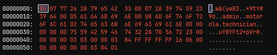</div>

The other settings were not easily distinguishable. So for now, I abandoned this effort and moved forward with applying the modified settings to the original firmware file. I did so using `dd` (although doing it via a hex editor would be fine too).

```
$ dd if=nvram.bin of=W25Q128FV_modded.bin seek=16711680 bs=1 count=65537
65536+0 records in
65536+0 records out
65536 bytes (66 kB, 64 KiB) copied, 0.102694 s, 638 kB/s
```

I confirmed the data copied over successfully via a hex editor (which it did), and proceeded to write the new firmware back to the flash chip.

### Modified Firmware
After hooking back up to UART and booting to the device, I now had verbose output written to the console:

<div style="text-align:center">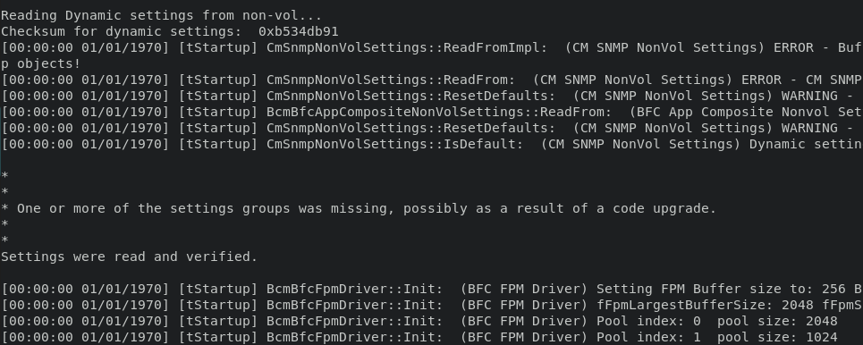</div>

Notice how it no longer had that pesky message that console output has been disabled in non-vol. But apparently some settings were messed up anyway, as stated by the boot log. Nonetheless, I logged the whole thing to a file and let it run for a few minutes. Ultimately, the device was just stuck in a scanning loop of frequencies:

```
<...snip...>

Scanning (pattern) DS Channel at 777000000 Hz...
Scanning (pattern) DS Channel at 771000000 Hz...
Scanning (pattern) DS Channel at 765000000 Hz...
Scanning (pattern) DS Channel at 759000000 Hz...
Scanning (pattern) DS Channel at 753000000 Hz...
Scanning (pattern) DS Channel at 747000000 Hz...
Scanning (pattern) DS Channel at 741000000 Hz...
Scanning (pattern) DS Channel at 735000000 Hz...
Scanning (pattern) DS Channel at 729000000 Hz...
Scanning (pattern) DS Channel at 723000000 Hz...
Scanning (pattern) DS Channel at 717000000 Hz...

<...snip...>
```

It did not spit out a console or anything. But before I jumped to conclusions, I went ahead and reviewed the new boot log for some insight as to what's going on. There was a lot more output this time, as you can imagine, and most of it pertained to booting the various components responsible for WiFi, Ethernet, SNMP, etc. One line that stood out to me was:

```
Type 'help' or '?' for a list of commands...
```

So I booted the router again to see if spamming `?` would result in anything, but nothing happened. There was another prompt during boot which I explored as well:

```
If you pressed the 's' key before this point, we will skip driver initialization...
```

Spamming `s` stopped driver initialization and dropped me straight to the supposed prompt, but input was still not being accepted and no prompt showed up.

```
<...snip...>

 | Build Options   : spectrum_analyzer newleds cacheopt spiflash dualflash avs cmvendor ipv6 eps  |
 | Build Options   : novlan bcm80211n usb20 fap_assist nat_hwaccel nomac14info nofactory          |
 | Build Options   : managedswitch nolinux_partitions telnet noslim nobattery legacy_parent       |
 | Build Options   : nowifi_spectrum_analyzer noieee1905 erouter openssh useformregistrar pptp    |
 | Build Options   : l2tpv2 monolith tr69 mtrlcmibs nopower nolitepower moto7315                  |
 +------------------------------------------------------------------------------------------------+

Didn't run the system; use 'run_app' to start things...


Type 'help' or '?' for a list of commands...
```

Something still wasn't right. After doing some additional Googling, I found this <a src=https://ecos.wtf>blog page</a> that was purely dedicated to pwning eCOS (what a find!). The first article on the blog actually goes into bypassing the disabled console prompt. One piece of advice I snagged from there was that the config for the device may be pieced together at boot from nvram and other places. This may be true as there exist several sections where the magic byte sequence appeared. I used the same technique used in the blog to locate all places where the sequence for `bfc` settings exists:

```
$ hexdump -C W25Q128FV-factory.bin | grep -C2 CMAp
*
000100c0  ff ff ff ff ff ff ff ff  ff ff 00 00 25 4c ca 34  |............%L.4|
000100d0  6e e6 00 09 43 4d 41 70  00 01 06 00 3d 4d 4c 6f  |n...CMAp....=MLo|
000100e0  67 00 03 00 00 00 07 3f  5c a7 45 a1 5d aa 4e b2  |g......?\.E.].N.|
000100f0  4c 2a 5d aa 40 aa 5c a2  0c aa 4d ba 5c aa 08 2a  |L*].@.\...M.\..*|
--
*
00ff00c0  ff ff ff ff ff ff ff ff  ff ff 00 00 3e 37 ed 2f  |............>7./|
00ff00d0  01 ee 00 10 43 4d 41 70  00 02 00 00 00 00 00 00  |....CMAp........|
00ff00e0  00 00 00 61 4d 4c 6f 67  00 05 00 07 77 26 28 79  |...aMLog....w&(y|
00ff00f0  65 42 33 00 07 2a 39 74  59 23 39 64 00 05 61 64  |eB3..*9tY#9d..ad|
--
*
00ff40c0  ff ff ff ff ff ff ff ff  ff ff 00 00 3e 3b 96 fd  |............>;..|
00ff40d0  d3 b2 00 10 43 4d 41 70  00 02 00 00 00 00 00 00  |....CMAp........|
00ff40e0  00 00 00 61 4d 4c 6f 67  00 05 00 07 77 26 28 79  |...aMLog....w&(y|
00ff40f0  65 42 33 00 07 2a 39 74  59 23 39 64 00 05 61 64  |eB3..*9tY#9d..ad|
--
*
00ff80c0  ff ff ff ff ff ff ff ff  ff ff 00 00 3e 76 c5 8d  |............>v..|
00ff80d0  8d 00 00 10 43 4d 41 70  00 02 00 00 00 00 00 00  |....CMAp........|
00ff80e0  00 00 00 61 4d 4c 6f 67  00 05 00 07 77 26 28 79  |...aMLog....w&(y|
00ff80f0  65 42 33 00 07 2a 39 74  59 23 39 64 00 05 61 64  |eB3..*9tY#9d..ad|
```

As you can see, there were four places where the config resided. I needed to extract all four and modify them one by one via `bcm2cfg`. The first chunk was actually at the beginning of the firmware file, and likely did not belong to NVRAM. As such, I skipped it. Here are the `dd` commands I used for the remaining three:

```
$ dd if=W25Q128FV-factory.bin of=chunk1.bin skip=16711680 count=16383 bs=1
$ dd if=W25Q128FV-factory.bin of=chunk2.bin skip=16728064 count=16383 bs=1
$ dd if=W25Q128FV-factory.bin of=chunk3.bin skip=16744448 bs=1
```

I used `bcm2cfg` to switch the `bfc.serial_console_mode` to `2` for each chunk and verified the settings were applied. Afterwards, I wrote the new sections back to the firmware file and flashed the chip. The device booted up no problem, but the eCOS shell still was not popping up.

This was when I had to shelf the project for some time. I did reach out to the author of the ecos.wtf blog about potential pointers but got no response. Similarly, I left an issue on the bcm2-utils Github page, with the same outcome. But do not worry, I'll find some time over the holidays to dig back into this and own these three modems!

## Closing Thoughts
Hope you enjoyed this first part of the hat-trick. I'm pretty confident that once I figure out this shell situation, I'll be able to pop all three without an issue. If you have experience dealing with eCOS or have overcome a similar issue with a shell not being displayed, please reach out! I would love to chat about it and give you some credit for the assistance.

I also partially started poking around another device recently, just out of curiosity :> so maybe expect a blog post on that sometime soon-ish.

Pce for now.
